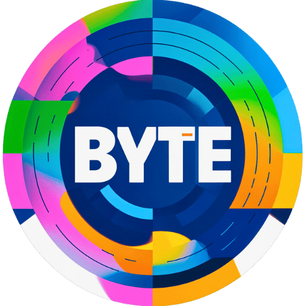

# ByteLighting

	

    
    
    
    
    
    
    
    
    

**在线地址：https://blog.bytelighting.cn**

## 博客介绍

ByteLighting -- BraumAce's Blog，基于 VuePress 构建的以 Markdown 为中心的轻量级静态博客。

特点：
- 多样化 Markdown 拓展：自定义容器和语法拓展、集成图表、PDF阅读器、视频播放器...
- 订阅和分享：支持 Atom、JSON 和 RSS 格式的订阅流、集成各大主流媒体分享功能
- 评论系统：集成 GitHub 应用 Giscus 评论
- 客户端搜索：支持全文索引、分词索引
- 更新时间：基于 Git 信息追加更新时间
- 音乐播放：流畅的全局音乐播放器
- 图标：集成 Iconfont 多样化图标
- SEO：集成 Umami 分析、Sitemap 生成器
- PWA：支持渐进式网络应用程序
- 部署：基于 GitHub 工作流的自动化部署更新

## 程序人生

- [电子书](https://blog.bytelighting.cn/ByteLighting/program/book/%E7%94%B5%E5%AD%90%E4%B9%A6.html)
- [文章](https://blog.bytelighting.cn/ByteLighting/program/article/%E9%98%85%E8%AF%BB%E5%8E%86%E5%8F%B2.html)
- 工具搭建
  - [科学上网与本地代理](https://blog.bytelighting.cn/ByteLighting/program/tool-build/%E7%A7%91%E5%AD%A6%E4%B8%8A%E7%BD%91%E4%B8%8E%E6%9C%AC%E5%9C%B0%E4%BB%A3%E7%90%86.html)
  - [自建网盘兼图床](https://blog.bytelighting.cn/ByteLighting/program/tool-build/%E8%87%AA%E5%BB%BA%E7%BD%91%E7%9B%98%E5%85%BC%E5%9B%BE%E5%BA%8A.html)
- [工作记录](https://blog.bytelighting.cn/ByteLighting/program/sundry/work-note/)

## 算法笔记

- [模版](https://blog.bytelighting.cn/ByteLighting/algorithm/template/)
- [笔记](https://blog.bytelighting.cn/ByteLighting/algorithm/note/)
- [剑指Offer](https://blog.bytelighting.cn/ByteLighting/algorithm/for-offer/)
- [LeetCode](https://blog.bytelighting.cn/ByteLighting/algorithm/leetcode/)

## 开源项目

- [用户中心](https://blog.bytelighting.cn/ByteLighting/open-source-project/user-center/)
- [用户匹配系统](https://blog.bytelighting.cn/ByteLighting/open-source-project/user-match/)
- [手写RPC框架]

## 计算机

- [Java](https://blog.bytelighting.cn/ByteLighting/computer/language/java/)
- [计算机网络]
- [数据库](https://blog.bytelighting.cn/ByteLighting/computer/database/)
- [操作系统](https://blog.bytelighting.cn/ByteLighting/computer/operating-system/)
- [设计模式]
- [中间件](https://blog.bytelighting.cn/ByteLighting/computer/middleware/)
- [Git]
- [Docker]

## 常用框架

- [Spring]
- [SpringBoot]
- [SPringCloud](https://blog.bytelighting.cn/ByteLighting/framework/spring-cloud/)
- [RuoYi](https://blog.bytelighting.cn/ByteLighting/framework/ruoyi/)

## 架构设计

- [系统设计](https://blog.bytelighting.cn/ByteLighting/architecture/system-design/)
- [Spring Cloud Alibaba]

## 关于本站

- [全部文章](https://blog.bytelighting.cn/ByteLighting/article/)
- [更新历史](https://blog.bytelighting.cn/ByteLighting/timeline/)
- [关于作者](https://blog.bytelighting.cn/ByteLighting/intro.html)

**本站支持：**
- Theme：[VuePress-Theme-Hope](https://theme-hope.vuejs.press/)
- 云存储：[ByteCloud](https://cloud.bytelighting.cn/)

## 勘误及提问

如果有疑问或者发现错误，可以在相应的 Issues 进行提问或勘误，也可以在 [ByteLighting](https://blog.bytelighting.cn) 网站对应的文章底部留言。

如果喜欢或者有所启发，欢迎 Star 😁。

