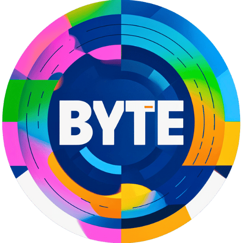

# ByteLighting

<p align="center">
	
</p>
<p align="center">
    
    
    
    
</p>

**在线地址：https://blog.bytelighting.cn**

## 简介

ByteLighting Wiki — 基于 [Karpathy llm-wiki](https://gist.github.com/karpathy/442a6bf555914893e9891c11519de94f) 模式构建的结构化知识库。内容由人和 LLM 共同维护，既可供人阅读，也可供 LLM 检索。

基于 VuePress 2 + [vuepress-theme-hope](https://theme-hope.vuejs.press/) 构建，支持 Obsidian 浏览和图谱视图。

## 知识领域

- [AI](https://blog.bytelighting.cn/domains/ai/) — 大模型应用、Prompt 工程、Agent
- [后端](https://blog.bytelighting.cn/domains/backend/) — Java、Spring、数据库、中间件、架构设计、项目实战
- [算法](https://blog.bytelighting.cn/domains/algorithms/) — 算法笔记、模板、LeetCode、面试题
- [计算机](https://blog.bytelighting.cn/domains/cs-fundamentals/) — 操作系统、设计模式、大数据
- [程序人生](https://blog.bytelighting.cn/domains/blog/) — 读书笔记、工具研究、杂谈

## 架构

```
ByteLighting/
├── CLAUDE.md              # Schema：LLM 行为规范
├── wiki.index.yaml        # 全局知识索引
├── raw/                   # 原始素材层（LLM 只读）
│   ├── legacy/            # 旧博客文章存档
│   └── inbox/             # 新素材投放区
├── src/domains/           # Wiki 层（LLM + 人共同维护）
│   ├── ai/
│   ├── backend/
│   ├── algorithms/
│   ├── cs-fundamentals/
│   └── blog/
└── src/synthesis/         # 跨领域综合分析
```

## 特性

- LLM 友好：生成 [llms.txt](https://blog.bytelighting.cn/llms.txt) 供外部 LLM 检索
- 全文搜索：SlimSearch 客户端搜索
- RSS 订阅：Atom / RSS 格式
- 评论系统：Giscus
- PWA 支持
- Obsidian 兼容：`src/` 目录可直接作为 Obsidian Vault

## 关于本站

- [全部文章](https://blog.bytelighting.cn/article/)
- [更新历史](https://blog.bytelighting.cn/timeline/)
- [关于作者](https://blog.bytelighting.cn/intro.html)

**本站支持：**
- Theme：[VuePress-Theme-Hope](https://theme-hope.vuejs.press/)
- 云存储：[ByteCloud](https://cloud.bytelighting.cn/)

## 勘误及提问

如果有疑问或者发现错误，可以在相应的 Issues 进行提问或勘误，也可以在 [ByteLighting](https://blog.bytelighting.cn) 网站对应的文章底部留言。

如果喜欢或者有所启发，欢迎 Star!
