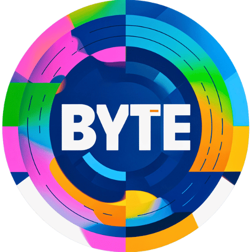

# ByteLighting

	

    
    
    
    

**在线地址：https://blog.bytelighting.cn**

## 简介

ByteLighting -- BraumAce's Blog，记录工程实践、知识沉淀与学习笔记。基于 VuePress 2 + [vuepress-theme-hope](https://theme-hope.vuejs.press/) 构建的以 Markdown 为中心的轻量级静态博客。

特点：
- 多样化 Markdown 拓展：自定义容器和语法拓展、集成图表、PDF阅读器、视频播放器...
- 订阅和分享：支持 Atom、JSON 和 RSS 格式的订阅流、集成各大主流媒体分享功能
- 评论系统：集成 GitHub 应用 Giscus 评论
- 客户端搜索：基于 SlimSearch 的全文索引、分词索引
- 更新时间：基于 Git 信息追加更新时间
- 音乐播放：流畅的全局音乐播放器
- 图标：集成 Iconfont 多样化图标
- SEO：集成 Umami 分析、Sitemap 生成器
- PWA：支持渐进式网络应用程序
- LLM 友好：生成 [llms.txt](https://blog.bytelighting.cn/llms.txt) 供外部 LLM 检索
- 部署：基于 GitHub 工作流的自动化部署更新

## 内容分类

- [AI](https://blog.bytelighting.cn/ai/) — 大模型应用、Prompt 工程、Agent
- [程序人生](https://blog.bytelighting.cn/program/) — 读书笔记、工具研究、杂谈
- [架构设计](https://blog.bytelighting.cn/architecture/) — 系统设计、软考系统架构师
- 计算机
  - [通用技术](https://blog.bytelighting.cn/computer/technology/) — 操作系统、设计模式、大数据
  - [算法](https://blog.bytelighting.cn/computer/algorithm/) — 算法笔记、模板、LeetCode、笔试题
  - [后端设计](https://blog.bytelighting.cn/computer/backend/) — Java、数据库、框架、项目实战

## 关于本站

- [全部文章](https://blog.bytelighting.cn/article/)
- [更新历史](https://blog.bytelighting.cn/timeline/)
- [关于作者](https://blog.bytelighting.cn/intro.html)

**本站支持：**
- Theme：[VuePress-Theme-Hope](https://theme-hope.vuejs.press/)
- 云存储：[ByteCloud](https://cloud.bytelighting.cn/)

## 勘误及提问

如果有疑问或者发现错误，可以在相应的 Issues 进行提问或勘误，也可以在 [ByteLighting](https://blog.bytelighting.cn) 网站对应的文章底部留言。

如果喜欢或者有所启发，欢迎 Star!
