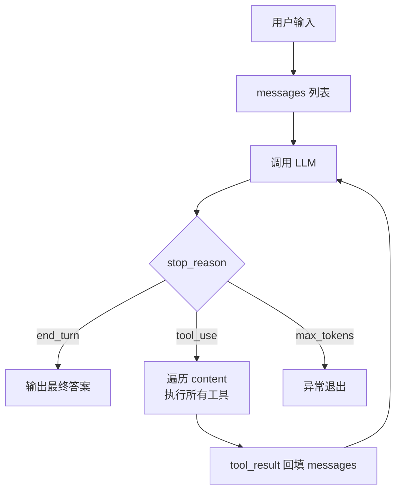

框架封装得越好，原理就藏得越深。本文用纯 Java + OkHttp + Jackson 从零写一个约 300 行的 Mini Agent，把 LLM 调用、Tool Calling、ReAct 循环、上下文管理几个核心机制裸写一遍。读完再回头看 Spring AI、LangChain4j 的源码或任何一篇 Agent 论文，会顺畅许多。

<!-- more -->

## 1. Agent 的本质：一个带工具的 while 循环

很多介绍 Agent 的文章会先抛「自主决策」「具身智能」之类的修辞。回到工程视角，本质只有一句：**一个带工具的 LLM，套在 while 循环里，由模型自己决定何时停止**。

伪代码长这样：

```java
public String agent(String userQuery) {
    List<Message> messages = new ArrayList<>();
    messages.add(Message.user(userQuery));

    while (true) {
        Response response = llm(messages, availableTools);
        if (response.isFinalAnswer()) {
            return response.getContent();
        }
        ToolResult result = executeTool(response.getToolCall());
        messages.add(response.toMessage());
        messages.add(Message.toolResult(result));
    }
}
```

整个回路只有两个分支：信息够了就出最终答案；不够就调一个工具把结果塞回上下文再问一遍。所谓 Agent，就是把「要不要继续」的决策权从工程师手上交给了 LLM。

后续章节沿着这个循环逐步补全：怎么调 LLM、怎么定义工具、怎么让循环跑多轮、怎么管上下文。

## 2. LLM 调用链路裸写

写循环之前，先把「调一次 LLM」这件事拆开来看。这一步不搞透，后面所有 bug 都会被框架抽象遮住。

### 2.1 一次调用里到底发生了什么

直觉上是一行函数调用，实际链路要长得多：

```text
用户输入
  → 拼装成 messages 数组（含 system / user / assistant 历史）
  → 序列化成 HTTP 请求体（JSON）
  → 发送到模型服务（如 api.anthropic.com）
  → 模型推理，流式返回 token
  → 客户端聚合 token，反序列化成结构化对象
  → 返回结果
```

任一环节出问题，表现都是「Agent 莫名其妙翻车」。Java 党的优势在于：当你用 OkHttp 裸写这条链路时，每一层都看得见。

### 2.2 项目依赖

只需要 OkHttp 与 Jackson：

```xml
<dependencies>
    <dependency>
        <groupId>com.squareup.okhttp3</groupId>
        <artifactId>okhttp</artifactId>
        <version>4.12.0</version>
    </dependency>
    <dependency>
        <groupId>com.fasterxml.jackson.core</groupId>
        <artifactId>jackson-databind</artifactId>
        <version>2.17.0</version>
    </dependency>
</dependencies>
```

文中以 Claude API 为例。OpenAI、通义、DeepSeek 走同一套路，换 URL 和 header 字段即可。

### 2.3 LLMClient 封装

```java
public class LLMClient {
    private static final String API_URL = "https://api.anthropic.com/v1/messages";
    private static final String API_KEY = System.getenv("ANTHROPIC_API_KEY");
    private static final OkHttpClient http = new OkHttpClient.Builder()
            .connectTimeout(30, TimeUnit.SECONDS)
            .readTimeout(120, TimeUnit.SECONDS)
            .build();
    private static final ObjectMapper mapper = new ObjectMapper();

    public static JsonNode call(List<Map<String, Object>> messages,
                                String system,
                                List<Map<String, Object>> tools) throws IOException {
        Map<String, Object> body = new LinkedHashMap<>();
        body.put("model", "claude-sonnet-4-5");
        body.put("max_tokens", 4096);
        body.put("messages", messages);
        if (system != null && !system.isBlank()) body.put("system", system);
        if (tools != null && !tools.isEmpty())  body.put("tools", tools);

        Request req = new Request.Builder()
                .url(API_URL)
                .header("x-api-key", API_KEY)
                .header("anthropic-version", "2023-06-01")
                .header("content-type", "application/json")
                .post(RequestBody.create(
                        mapper.writeValueAsString(body),
                        MediaType.get("application/json")))
                .build();

        try (Response resp = http.newCall(req).execute()) {
            if (!resp.isSuccessful()) {
                throw new IOException("LLM call failed: " + resp.code() + " " + resp.body().string());
            }
            return mapper.readTree(resp.body().string());
        }
    }
}
```

Python 的 SDK 把请求体的形态、响应 JSON 的结构都包好了，结果就是出问题时看不见底层。OkHttp 写法的最大收益是请求与响应都是可见可调的 JSON，调试时直接打印就能定位问题。

### 2.4 messages 数组：Agent 的记忆载体

LLM 本身是无状态的。**所谓「记忆」，本质上就是把历史对话全部塞回 messages 数组里再发一次**。

一次多轮对话用 Java 的 `Map` 表示长这样：

```java
List.of(
    Map.of("role", "user",      "content", "帮我查下北京天气"),
    Map.of("role", "assistant", "content", "好的，我调用一下天气工具..."),
    Map.of("role", "user",      "content", "工具返回结果：晴，25 度"),
    Map.of("role", "assistant", "content", "北京今天晴，25 度，挺舒服")
);
```

后面所有的「上下文」「记忆」「多轮对话」「压缩窗口」，操作的都是这个列表。把这一点想透，再看 LangChain4j 的 `ChatMemory` 设计就只是给同一个列表换了几种容器。

## 3. Tool Calling：给 Agent 安上手

光会聊天的不是 Agent，是聊天机器人。Agent 之所以能「做事」，是因为它能调工具。

### 3.1 用 JSON Schema 声明工具

主流模型的工具调用协议都是基于 JSON Schema 的。定义一个工具要交代三件事：叫什么、做什么、参数怎么传。

```java
Map<String, Object> getWeatherTool = Map.of(
    "name", "get_weather",
    "description", "查询指定城市的当前天气",
    "input_schema", Map.of(
        "type", "object",
        "properties", Map.of(
            "city", Map.of(
                "type", "string",
                "description", "城市名，比如：北京、上海"
            )
        ),
        "required", List.of("city")
    )
);
```

`description` 是模型唯一的判定依据，**写得越精确，模型用得越准**。Agent 不工作时根因往往不是代码 bug，而是工具描述写得跟天书一样，模型根本不知道该在什么场景调它。

### 3.2 用函数式接口承载执行

工具声明是给模型看的，执行还得落到本地代码上。Java 没有 Python 那种灵活字典，用 `Function` 接口把「工具实现」抽象出来：

```java
public class ToolRegistry {
    @FunctionalInterface
    public interface Tool {
        String execute(Map<String, Object> args) throws Exception;
    }

    private static final Map<String, Tool> REGISTRY = new HashMap<>();

    public static void register(String name, Tool tool) {
        REGISTRY.put(name, tool);
    }

    public static String execute(String name, Map<String, Object> args) {
        Tool tool = REGISTRY.get(name);
        if (tool == null) return "Error: 未知工具 " + name;
        try {
            return tool.execute(args);
        } catch (Exception e) {
            // 关键：把异常作为结果返回，不要抛出去
            return "Error: 工具执行失败 - " + e.getMessage();
        }
    }
}
```

注册时把名字和 Lambda 绑起来即可：

```java
ToolRegistry.register("get_weather", args -> {
    String city = (String) args.get("city");
    return city + " 今天晴，气温 25 度，微风";
});
```

注意捕获异常那一段——一定要把错误信息作为工具结果返回给模型，而不是抛出去 crash 整个循环。模型看到 `Error: ...` 字符串有自我纠错能力，下一轮会自己改参数重试；直接抛异常等于让 Agent 死在第一次失败上。

### 3.3 单步工具调用的完整链路

声明加执行串起来，一次工具调用的完整路径如下：

```text
用户问题
  → LLM（带工具声明）
  → 返回 tool_use 结构（要调 get_weather，参数 city=北京）
  → 本地执行 get_weather("北京")
  → 拿到结果字符串
  → 把结果作为 tool_result 塞回 messages
  → 再次调用 LLM
  → LLM 输出最终答案
```

跑通这一段，已经能完成「问一次、调一次工具、回一次答」的简单场景。但真实场景里 Agent 经常要连续调好几次工具，比如「对比北京和上海的天气」要并行调两次，这就需要把单步循环升级成多步。

## 4. ReAct 循环：让模型自己决定何时停

ReAct 来自 Yao 等人 2022 年的论文，全称 Reasoning + Acting。学术语言翻译成工程语言只有一句：把单次工具调用塞进 `for` 循环，让模型自己判断什么时候不再需要工具。

### 4.1 单步变多步

```java
public String reactAgent(String userQuery, int maxIterations) throws IOException {
    List<Map<String, Object>> messages = new ArrayList<>();
    messages.add(Map.of("role", "user", "content", userQuery));

    for (int i = 0; i < maxIterations; i++) {
        JsonNode response = LLMClient.call(messages, systemPrompt, toolSchemas);
        String stopReason = response.get("stop_reason").asText();

        // 终止条件：模型说我说完了
        if ("end_turn".equals(stopReason)) {
            return extractText(response);
        }

        // 否则就是要调工具
        if ("tool_use".equals(stopReason)) {
            messages.add(Map.of(
                "role", "assistant",
                "content", mapper.convertValue(response.get("content"), List.class)
            ));

            // 一次响应里可能有多个 tool_use（并行调用），全部执行
            List<Map<String, Object>> toolResults = new ArrayList<>();
            for (JsonNode block : response.get("content")) {
                if ("tool_use".equals(block.get("type").asText())) {
                    String toolName = block.get("name").asText();
                    Map<String, Object> args = mapper.convertValue(
                        block.get("input"), Map.class);
                    String result = ToolRegistry.execute(toolName, args);

                    toolResults.add(Map.of(
                        "type", "tool_result",
                        "tool_use_id", block.get("id").asText(),
                        "content", result
                    ));
                }
            }
            messages.add(Map.of("role", "user", "content", toolResults));
        }
    }
    return "Agent 达到最大迭代次数，强制退出";
}
```

LangChain4j 那一坨 ReAct Agent 的代码，剥掉所有抽象后核心逻辑就是这几十行。整体回路画出来是这样：



### 4.2 三个一定要踩稳的设计点

`maxIterations` **必须设上限**。模型在工具描述写得不清楚时会陷入死循环，一直调工具、永远不输出最终答案。生产环境里出过单日烧掉数千元 API 账单的案例，根因就是少了 `for (int i = 0; i < maxIterations; i++)` 这一行。

**一次响应可能有多个** `tool_use`。Claude、GPT-4 都支持并行工具调用，一次返回多个工具请求是常态。处理时要遍历 `content` 数组把所有 `tool_use` 全部执行，再把所有 `tool_result` 一起塞回 messages。Java 这里很容易上 `CompletableFuture.allOf()` 并行跑，延迟能砍一半以上。

**终止判断用** `stop_reason` **字段，不要去猜文本内容**。响应 JSON 里已经明确给出了三种状态：

| stop_reason | 含义 |
| --- | --- |
| `end_turn` | 模型自然结束，输出最终答案 |
| `tool_use` | 模型要调工具 |
| `max_tokens` | 超出 token 限制（一般是出问题了） |

按字段分支，不要正则匹配输出里的「完成了」「结束」这种字符串，那是脆弱的。

## 5. 上下文管理：在「够用」和「成本可控」之间找平衡

ReAct 循环跑几轮，问题就来了：`messages` 列表会越来越长。每次调用都把全部历史发过去，token 成本指数级增长，模型还会被无关历史干扰，效果反而下降。

任何严肃的 Agent 框架都要做 Context Management。下面三种策略由轻到重。

### 5.1 滑动窗口

只保留最近 N 轮对话，把最初的用户问题作为锚点留下：

```java
public static List<Map<String, Object>> trimMessages(
        List<Map<String, Object>> messages, int maxTurns) {
    if (messages.size() <= maxTurns * 2) return messages;
    List<Map<String, Object>> trimmed = new ArrayList<>();
    trimmed.add(messages.get(0));  // 保留第一条（最初的用户问题）
    trimmed.addAll(messages.subList(messages.size() - (maxTurns * 2 - 1), messages.size()));
    return trimmed;
}
```

简单粗暴，适合短对话场景。

### 5.2 摘要压缩

当 messages 超过某个阈值，调一次 LLM 把历史压缩成摘要：

```java
public List<Map<String, Object>> summarizeHistory(List<Map<String, Object>> messages) {
    String prompt = "把下面的对话历史压缩成一段简短摘要，保留关键信息：\n" + messages;
    JsonNode resp = LLMClient.call(
        List.of(Map.of("role", "user", "content", prompt)), "", null);
    String summary = resp.get("content").get(0).get("text").asText();
    return List.of(Map.of("role", "user", "content", "[历史摘要]：" + summary));
}
```

适合长对话、复杂任务。摘要本身也消耗 token，不要太频繁地触发。

### 5.3 结构化记忆

把「短期对话历史」和「长期记忆」分开存储：长期记忆落到向量库（PgVector、Milvus、Redis Stack），用相似度检索按需召回，再拼进当前上下文。这一层展开够单独写一篇，本文不深入。

核心思想就一句：**上下文不是越多越好，而是越相关越好**。

### 5.4 工具结果同样要精简

容易被忽视的一点：工具返回的结果也算上下文。一个搜索工具如果原样返回几万字的网页内容，messages 会被瞬间撑爆。实践上有两条路：

- 工具内部做截断（例如只返回前 2000 字符）
- 对工具结果先跑一次 LLM 做摘要再回填

工程里 80% 的 token 成本浪费都在这里。框架文档很少强调，但产线上每一笔账单都会提醒你。

## 6. 组装一个完整的 Mini Agent

把前面五节拼起来，下面是约 300 行可直接运行的代码。

```java
import com.fasterxml.jackson.databind.JsonNode;
import com.fasterxml.jackson.databind.ObjectMapper;
import okhttp3.*;

import java.io.IOException;
import java.time.LocalDateTime;
import java.time.format.DateTimeFormatter;
import java.util.*;
import java.util.concurrent.TimeUnit;

public class MiniAgent {

    // ==================== 1. LLM 客户端 ====================
    private static final String API_URL = "https://api.anthropic.com/v1/messages";
    private static final String API_KEY = System.getenv("ANTHROPIC_API_KEY");
    private static final OkHttpClient http = new OkHttpClient.Builder()
            .connectTimeout(30, TimeUnit.SECONDS)
            .readTimeout(120, TimeUnit.SECONDS)
            .build();
    private static final ObjectMapper mapper = new ObjectMapper();

    private static JsonNode callLLM(List<Map<String, Object>> messages,
                                     String system,
                                     List<Map<String, Object>> tools) throws IOException {
        Map<String, Object> body = new LinkedHashMap<>();
        body.put("model", "claude-sonnet-4-5");
        body.put("max_tokens", 4096);
        body.put("messages", messages);
        if (system != null && !system.isBlank()) body.put("system", system);
        if (tools != null && !tools.isEmpty())  body.put("tools", tools);

        Request req = new Request.Builder()
                .url(API_URL)
                .header("x-api-key", API_KEY)
                .header("anthropic-version", "2023-06-01")
                .header("content-type", "application/json")
                .post(RequestBody.create(
                        mapper.writeValueAsString(body),
                        MediaType.get("application/json")))
                .build();

        try (Response resp = http.newCall(req).execute()) {
            String respBody = resp.body().string();
            if (!resp.isSuccessful()) {
                throw new IOException("LLM error: " + resp.code() + " " + respBody);
            }
            return mapper.readTree(respBody);
        }
    }

    // ==================== 2. 工具系统 ====================
    @FunctionalInterface
    interface Tool {
        String execute(Map<String, Object> args) throws Exception;
    }

    private final Map<String, Tool> registry = new HashMap<>();
    private final List<Map<String, Object>> toolSchemas = new ArrayList<>();

    public void registerTool(String name, String description,
                             Map<String, Object> inputSchema, Tool tool) {
        registry.put(name, tool);
        toolSchemas.add(Map.of(
                "name", name,
                "description", description,
                "input_schema", inputSchema
        ));
    }

    private String executeTool(String name, Map<String, Object> args) {
        Tool tool = registry.get(name);
        if (tool == null) return "Error: 未知工具 " + name;
        try {
            return tool.execute(args);
        } catch (Exception e) {
            return "Error: " + e.getMessage();
        }
    }

    // ==================== 3. 上下文管理 ====================
    private static List<Map<String, Object>> trimMessages(
            List<Map<String, Object>> msgs, int maxTurns) {
        if (msgs.size() <= maxTurns * 2) return msgs;
        List<Map<String, Object>> trimmed = new ArrayList<>();
        trimmed.add(msgs.get(0));
        trimmed.addAll(msgs.subList(msgs.size() - (maxTurns * 2 - 1), msgs.size()));
        return trimmed;
    }

    // ==================== 4. Agent 主循环 ====================
    private final String systemPrompt;
    private List<Map<String, Object>> messages = new ArrayList<>();

    public MiniAgent(String systemPrompt) {
        this.systemPrompt = systemPrompt;
    }

    public String run(String userInput, int maxIterations, boolean verbose) throws IOException {
        messages.add(Map.of("role", "user", "content", userInput));

        for (int i = 0; i < maxIterations; i++) {
            if (verbose) System.out.println("\n--- 第 " + (i + 1) + " 轮 ---");

            messages = trimMessages(messages, 10);
            JsonNode resp = callLLM(messages, systemPrompt, toolSchemas);
            String stopReason = resp.get("stop_reason").asText();

            // 终止：模型给出最终答案
            if ("end_turn".equals(stopReason)) {
                StringBuilder finalText = new StringBuilder();
                for (JsonNode b : resp.get("content")) {
                    if ("text".equals(b.get("type").asText())) {
                        finalText.append(b.get("text").asText());
                    }
                }
                messages.add(Map.of(
                        "role", "assistant",
                        "content", mapper.convertValue(resp.get("content"), List.class)
                ));
                return finalText.toString();
            }

            // 工具调用
            if ("tool_use".equals(stopReason)) {
                messages.add(Map.of(
                        "role", "assistant",
                        "content", mapper.convertValue(resp.get("content"), List.class)
                ));

                List<Map<String, Object>> toolResults = new ArrayList<>();
                for (JsonNode block : resp.get("content")) {
                    if ("tool_use".equals(block.get("type").asText())) {
                        String name = block.get("name").asText();
                        Map<String, Object> args = mapper.convertValue(
                                block.get("input"), Map.class);
                        if (verbose) System.out.println("调用工具: " + name + "(" + args + ")");
                        String result = executeTool(name, args);
                        if (verbose) System.out.println("结果: " +
                                result.substring(0, Math.min(100, result.length())));
                        toolResults.add(Map.of(
                                "type", "tool_result",
                                "tool_use_id", block.get("id").asText(),
                                "content", result
                        ));
                    }
                }
                messages.add(Map.of("role", "user", "content", toolResults));
            }
        }
        return "达到最大迭代次数";
    }

    // ==================== 5. 跑起来 ====================
    public static void main(String[] args) throws IOException {
        MiniAgent agent = new MiniAgent("你是一个聪明的助手，需要时主动调用工具。");

        // 注册三个工具
        agent.registerTool("get_weather", "查询指定城市的当前天气",
                Map.of("type", "object",
                       "properties", Map.of("city", Map.of("type", "string")),
                       "required", List.of("city")),
                a -> a.get("city") + " 今天晴，气温 25 度，微风");

        agent.registerTool("get_current_time", "获取当前时间",
                Map.of("type", "object", "properties", Map.of()),
                a -> LocalDateTime.now()
                        .format(DateTimeFormatter.ofPattern("yyyy-MM-dd HH:mm:ss")));

        agent.registerTool("calculate", "执行数学表达式计算",
                Map.of("type", "object",
                       "properties", Map.of("expression", Map.of("type", "string")),
                       "required", List.of("expression")),
                a -> {
                    // 生产环境请接入 exp4j / JEXL 等安全表达式引擎
                    // 此处仅用 mock 返回，避免演示代码引入 RCE 风险
                    return "[mock] 表达式 " + a.get("expression") + " = 3584";
                });

        String answer = agent.run(
                "现在几点了？顺便帮我算一下 (1024 + 768) * 2，再告诉我北京和上海的天气。",
                10, true);
        System.out.println("\n最终答案：" + answer);
    }
}
```

跑起来大致是这样的输出：

```text
--- 第 1 轮 ---
调用工具: get_current_time({})
结果: 2026-05-09 14:23:11
调用工具: calculate({expression=(1024 + 768) * 2})
结果: [mock] 表达式 (1024 + 768) * 2 = 3584
调用工具: get_weather({city=北京})
结果: 北京 今天晴，气温 25 度，微风
调用工具: get_weather({city=上海})
结果: 上海 今天晴，气温 25 度，微风

--- 第 2 轮 ---
最终答案：现在是 2026-05-09 14:23:11。
(1024 + 768) * 2 = 3584。
北京和上海今天都是晴天，气温 25 度，微风。
```

一个能并行调用工具、能多轮推理、能自主终止的 Agent，300 行代码，零 AI SDK 依赖。

## 7. Mini Agent 与 Spring AI / LangChain4j 的差距在哪里

可能有人会问：Spring AI、LangChain4j 那一堆代码到底在做什么？把它们没做、而成熟框架做了的事情列出来：

| 模块 | Mini Agent | Spring AI / LangChain4j |
| --- | --- | --- |
| 工具调用 | 有 | 有，注解驱动（`@Tool`） |
| ReAct 循环 | 有 | 有 |
| 上下文裁剪 | 简单滑窗 | 多种 `ChatMemory` 策略 |
| 流式输出（SSE） | 没做 | 完整 Reactor 集成 |
| 多模型适配 | 写死 Claude | 几十种模型统一抽象 |
| 持久化记忆 | 没做 | Redis / PgVector / Milvus |
| 多 Agent 协作 | 没做 | 有 |
| 可观测性 | `println` | Micrometer / OTel |
| 异步与并发 | 没做 | Reactive 全家桶 |
| Spring Boot 集成 | 纯手写 | Starter + 自动装配 |
| RAG 全链路 | 没做 | DocumentLoader / Splitter / 向量库 |

成熟框架解决的是 **工程化问题**，不是 **原理问题**。理解原理之后才有判断力：什么时候上框架、什么时候手搓更划算，工具描述与上下文这些「非代码」环节怎么调到位，Debug 框架抽象不到的问题应该往哪查。

## 8. 实战经验

写过几个 Agent 才知道的坑：

- **工具描述比代码重要 10 倍**。Agent 不工作时优先检查 `description`、参数 `description` 是否清晰、是否覆盖了所有有效参数组合。这一项写对能解决一大半问题。
- **永远要捕获工具异常并把错误信息返回给模型**。Java 党特别注意：`throw new RuntimeException` 会让 Agent 死在第一次失败上，把异常 message 包装成 `Error: ...` 返回，模型会自己看到错误并修正参数重试。
- **`maxIterations` 不是凑数的**。没它你迟早被一个死循环刷爆账单，建议再叠加一个累计 token 上限作为双保险。
- **别一上来就上向量库**。80% 的「长期记忆」需求一张 MySQL 表加 LIKE 查询就够了，复杂到必须用相似度匹配时再上向量库。
- **流式输出（SSE）越早上越好**。一旦用户开始用 Agent，再加流式就要改整条调用链。Spring Boot 用 `SseEmitter` 或 `Flux<String>` 都行。
- **工具调用必须并发化**。模型一次返回多个 `tool_use` 是常态，demo 里串行执行是为了清晰，生产代码必须上 `CompletableFuture.allOf()`，整体延迟能减少一半以上。
- **上线前一定要加 trace**。每一步的 messages、tool_call、tool_result 全部落日志或上 Micrometer + Zipkin / Jaeger，否则线上一翻车就是黑盒。

::: caution
不要在工具实现里执行用户输入的代码字符串。Demo 里 `calculate` 工具特意用 mock 返回，生产环境请接入 `exp4j`、`JEXL` 这类安全表达式引擎，否则就是标准的 RCE 漏洞。
:::

## 9. 写在最后

整篇文章只做了一件事——把 Agent 这个黑盒拆开，让每个齿轮都看得见。

- **Agent 本质**：LLM + 工具 + while 循环
- **LLM 本质**：无状态函数，所谓记忆全在 messages 列表里
- **工具本质**：JSON Schema 声明 + 本地方法执行 + 结果回填
- **ReAct 本质**：让模型自己决定何时停，靠 `stop_reason` 判断
- **上下文管理本质**：在「信息够用」和「成本可控」之间做平衡

框架可以学完就忘，原理学一次受用很久。
