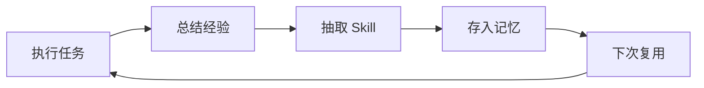
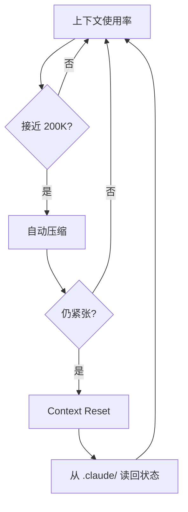

OpenClaw、Hermes、Claude Code 是 Harness Engineering 在不同问题域上沉淀出的三种范式：让 Agent 能干活、让 Agent 越用越强、让 Agent 干得稳。本文从架构、记忆、工具、上下文、安全五个维度横向拆解，看清这三条演进路径背后的设计取舍。

<!-- more -->

## 1. 三个框架的定位与背景

Agent 框架今天能跑出形态各异的设计，是因为它们最初解决的痛点本就不同。把三者放进同一张对比表之前，先各自交代来路。

### 1.1 OpenClaw：全平台个人助手

OpenClaw 是一个开源的个人 AI 助手项目，吉祥物是一只太空龙虾，社区里习惯称它「小龙虾」。它的核心定位是 **消息优先、本地优先**：通过一个网关进程把 WhatsApp、Telegram、Slack、Discord、微信、QQ、飞书等 25 种以上消息平台打通，让 AI 助手以聊天为统一入口，运行在用户最常用的渠道里。

项目最早由独立开发者社区主导，后来被 OpenAI 收编。这种「先社区、后大厂」的出身，决定了它的基因是开源、开放、社区驱动。技术栈是 TypeScript，进程跑在本地，隐私边界比云服务收得更紧。

### 1.2 Hermes：自进化 Agent

Hermes 由 Nous Research 推出，slogan 是「The agent that grows with you」。它做了一次关键的范式升级：从「工具执行系统」走向 **自进化系统**。

具体做法是把学习闭环嵌进 Agent Loop——每完成一个任务就总结经验、抽取模式、生成新的 skill 落到本地。下次遇到类似任务时直接复用学到的 skill，不再从头试错。

技术栈是 Python，核心差异化标签是学习闭环。

### 1.3 Claude Code：产品级编程 Agent

Claude Code 是 Anthropic 官方推出的 AI 编程助手，定位是编程场景的专用 Agent，和 Cursor、Windsurf 同类。它的特别之处在于：2026 年 3 月 31 日的一次意外公开，使得 51.2 万行 TypeScript 源码完整暴露。这次泄露让外界第一次拿到了一个产品级 AI 编程工具的完整内部结构——系统提示词、工具定义、安全规则、子 Agent 架构、上下文管理策略一览无余。

技术栈是 TypeScript，定位非常聚焦：把编程场景这一类任务做到工程化极致。

### 1.4 一句话定位

| 框架 | 一句话定位 | 核心差异化 |
| --- | --- | --- |
| **OpenClaw** | 全平台个人助手 | 消息覆盖最广，本地隐私 |
| **Hermes** | 自进化 Agent | 学习闭环，越用越强 |
| **Claude Code** | 产品级编程 Agent | 工程化与安全机制最完善 |

三个框架的演进方向，可以归结成一条主线：让 Agent 能干活 → 让 Agent 越用越强 → 让 Agent 干得稳。后续章节都沿着这条线展开。

## 2. 架构对比：底层设计思路

三个框架的核心都是一个循环：接收任务 → 思考 → 执行 → 观察 → 继续或结束。差异不在「有没有循环」，而在循环本身的编排方式。

### 2.1 Agent Loop 的实现方式

OpenClaw 采用的是 **单 Agent 线性循环**：一个 Agent 跑一个循环，输入消息、调用工具、返回结果，没有子 Agent，没有复杂编排。结构清晰、心智负担低，代价是复杂任务的拆解只能靠 Prompt 自然语言完成，或者交给外部系统调度。

Hermes 在单 Agent 循环之上加了子 Agent 并行委派：主 Agent 可以把子任务派给子 Agent 并行执行，结果汇总后主 Agent 继续决策。更关键的是，Hermes 在循环里嵌进了 **学习闭环**：执行、总结、生成 skill、存入记忆、下次复用，让 Agent 不再「跑完就忘」。



Claude Code 的核心循环更精简，伪代码骨架只有几行：

```typescript
while (true) {
  const response = await claude.chat(messages);
  if (response.type === 'text') break;             // 模型判断任务完成
  if (response.type === 'tool_use') {
    const result = await executeTool(response.tool, response.params);
    messages.push(result);                          // 结果加入下一轮
  }
}
```

在这个简单 `while` 循环之上，它扩展了三种子 Agent：Explore（搜索探索）、Plan（规划拆解）、General-purpose（通用执行）。子 Agent 拥有独立上下文窗口，跑完后只把摘要返回主 Agent，避免大块原始结果污染主窗口。

### 2.2 架构对比表

| 维度 | OpenClaw | Hermes | Claude Code |
| --- | --- | --- | --- |
| **核心循环** | 单 Agent 线性 | 单 Agent + 子 Agent 并行 | `while` 循环 + 三种子 Agent |
| **编排方式** | 线性执行 | 可并行委派 | 串行为主，子 Agent 独立上下文 |
| **学习能力** | 无 | 学习闭环 | 无（靠 `CLAUDE.md` 沉淀项目知识） |
| **复杂任务** | 靠 Prompt 拆解 | 子 Agent 并行 | 子 Agent 隔离执行 |
| **实现语言** | TypeScript | Python | TypeScript |

三种循环对应三种取舍：OpenClaw 追求最小复杂度，Hermes 把成长性写进循环本身，Claude Code 用子 Agent 把复杂任务的副作用关在隔离窗口里。

## 3. 记忆机制对比：状态如何被管理

如果说架构决定 Agent「怎么跑」，那么记忆机制就决定它「能不能跨次跑」。这是三个框架差异最大的部分。

### 3.1 OpenClaw：文件注入 + 本地持久化

OpenClaw 的记忆系统建立在三个文件之上：

- `AGENTS.md`：项目级规范和上下文，每次对话都注入
- `SOUL.md`：Agent 的「灵魂」——角色、性格、说话风格
- `TOOLS.md`：可用工具的说明与规则

每次对话开始时，三个文件的内容直接拼到 System Prompt 里；对话过程中的中间结果，则写到本地文件系统持久化。问题在于 **OpenClaw 没有跨会话记忆**：每次对话都是「新手」，不会记得上次聊了什么。`AGENTS.md` 是人手写的规则，不是 Agent 自己学到的经验。

### 3.2 Hermes：分层记忆 + 用户建模 + 跨会话搜索

Hermes 把记忆切成四层。

第一层是持久化记忆：对话历史与执行结果落到本地，下次启动可重新加载。

第二层是 **用户建模（Honcho）**：Hermes 内置了一套方言式用户建模系统，主动学习用户的偏好、习惯、工作方式。它不止「记住你上次说了什么」，而是更进一步——「理解你是哪种类型的用户」。

第三层是跨会话搜索：用 SQLite 的 FTS5 全文搜索引擎，在历史会话里检索相关片段。你问「上次那个部署脚本怎么写的」，Hermes 能从过去的会话里捞出来。

第四层是自我督促：Agent 主动给自己写备忘——「这个用户不喜欢长回复」「这个项目用 TypeScript」，相当于自己生成自己的「使用说明」。

更关键的是，Hermes 的记忆不止于「记住」，还能转化为技能：复杂任务完成后自动从经验里抽取模式，生成 skill 文件存到 `~/.hermes/skills/`，下次直接复用。这让记忆从「日志」升级成「能力」。

### 3.3 Claude Code：CLAUDE.md + .claude/ 目录 + 外化状态

Claude Code 的记忆系统同样有三层，但每一层的设计动机都偏「工程化」。

第一层是项目知识层 `CLAUDE.md`，放在项目根目录，承载项目规范、技术栈、代码风格。每次对话都注入，但有一个特别的设计：**作为用户消息注入，而非 System Prompt 注入**。这样 `CLAUDE.md` 的优先级低于 Anthropic 内置的安全规则，但高于普通用户消息，避免用户自定义指令意外覆盖安全约束。

`CLAUDE.md` 还支持层级结构：根目录的全局生效，子目录的只在进入该目录时注入，让不同模块可以有不同规范。

第二层是会话状态层 `.claude/` 目录。Agent 的中间状态、任务进度、分析结论全部外化到文件系统。这是 Harness Engineering 里反复强调的「状态外化」：不在上下文窗口里存状态，而是写到文件里。即使整窗 Context Reset，新窗口从文件读一遍就能续上。

第三层是跨项目长期记忆层 `~/.claude/`，存放用户偏好、常用命令模式等通用知识。

### 3.4 记忆机制对比表

| 维度 | OpenClaw | Hermes | Claude Code |
| --- | --- | --- | --- |
| **工作记忆** | `AGENTS.md` / `SOUL.md` / `TOOLS.md` 注入 | `AGENTS.md` + 动态加载 | `CLAUDE.md` 作为用户消息注入 |
| **短期记忆** | 本地文件持久化 | 对话历史 + FTS5 搜索 | `.claude/` 目录 + 会话状态文件 |
| **长期记忆** | 无 | Honcho 用户建模 + 跨会话搜索 | `~/.claude/` + 分层 `CLAUDE.md` |
| **经验积累** | 无（每次都是新手） | 学习闭环：执行 → 总结 → 生成 skill | 无自动积累，靠人维护 `CLAUDE.md` |
| **跨会话** | 不支持 | 支持（FTS5 + Honcho） | 支持（文件系统外化） |
| **记忆检索** | 无 | FTS5 全文搜索 + 语义匹配 | 文件读取（`Read` 工具） |

OpenClaw 最简单，只靠文件注入，没有跨会话记忆；Hermes 最深，用户建模、跨会话搜索、学习闭环联动，能从经验里自动生成技能；Claude Code 最工程化，靠文件系统把状态搬到上下文窗口之外，再用分层注入把规则与上下文按需带回。

## 4. 工具调用对比：能力如何被组织

工具调用决定了 Agent 真正能「做什么」。三个框架在这里的分歧，是「开放生态 + 协议接入」与「内置工具 + 严格控制」两种思路的对照。

### 4.1 OpenClaw：MCP 协议 + ClawHub 技能市场

OpenClaw 的工具系统基于 **MCP（Model Context Protocol）协议**，所有工具都通过 MCP 标准化接口接入。社区还维护着 ClawHub 技能市场——一个类似 App Store 的工具与技能包仓库，装上即用。技能生态的丰富度是 OpenClaw 的一大优势。

执行环境靠 Docker 沙箱或 SSH 后端隔离：工具跑在沙箱里，不直接操作宿主系统。Agent 即便选错命令，影响范围也限制在沙箱内可见的范围。

### 4.2 Hermes：MCP + 自生成技能

Hermes 同样基于 MCP，但在两个方向上做了升级。

第一是 **技能可自动生成**：不只依赖社区贡献，Agent 完成任务后能自己总结一套 skill 存到 `~/.hermes/skills/`，遵循 `agentskills.io` 标准。下次遇到类似任务直接搜索复用，不必从工具大池子里现找。

第二是工具白名单：不是把所有 MCP 工具一股脑暴露给 Agent，而是根据任务动态决定哪些工具可用，缩小「选错工具」的概率。Hermes 还支持本地、Docker、SSH、K8s 等 6 种终端后端，以适配不同的部署形态。

### 4.3 Claude Code：18+ 内置工具 + 权限分级

Claude Code 走的是与前两者不同的路线——**专用内置工具**。它虽然也支持 MCP Server 接入，但核心的 18 多个工具都在代码里直接定义，每个工具都有严格的参数 schema 与使用规则。这些工具大致分五类：

| 类别 | 代表工具 |
| --- | --- |
| 文件操作 | `Read` / `Write` / `Edit` / `Glob` / `Grep` |
| 执行 | `Bash` / `NotebookEdit` |
| 网络 | `WebFetch` / `WebSearch` |
| Agent | `Agent` / `Skill` |
| 交互 | `AskUserQuestion` / `TodoWrite` |

最关键的设计是权限分级：`deny > ask > allow`。

- `deny`：直接拒绝执行
- `ask`：弹窗征求用户确认后执行
- `allow`：直接放行

权限可以按「工具 + 路径 + 参数」粒度配置。例如：允许读 `src/`，写 `src/` 要 `ask`，删除任何文件都拒绝。

Claude Code 还在系统提示词里写明了「Prefer dedicated tools over Bash」——能用 `Read` 就别用 `cat`，能用 `Edit` 就别用 `sed`。专用工具自带更好的错误处理与权限控制，这是把规则嵌进工具描述本身的做法。

### 4.4 工具调用对比表

| 维度 | OpenClaw | Hermes | Claude Code |
| --- | --- | --- | --- |
| **工具协议** | MCP | MCP | 内置定义 + 支持 MCP Server |
| **工具来源** | ClawHub 社区市场 | 自动生成 + `agentskills.io` 标准 | 18+ 内置工具 |
| **执行隔离** | Docker / SSH 沙箱 | 6 种终端后端 | 本地直接执行 + 权限分级 |
| **权限控制** | 沙箱隔离 | 工具白名单 | `deny > ask > allow` 三级 |
| **工具选择** | Prompt 驱动 | 动态白名单 | 工具描述即规则 + 专用工具优先 |
| **技能复用** | 社区市场下载 | 自动生成 + 社区标准 | Skill 调用预定义工作流 |

三种取舍服务于三种产品形态：OpenClaw 在「让工具生态尽可能大」，Hermes 在「让 Agent 自己长出工具」，Claude Code 在「把工具收得很紧、每个都给得很稳」。

## 5. 上下文管理对比：窗口紧张时的取舍

上下文窗口永远是稀缺资源。三个框架都在解同一道题：有限窗口里到底应该放什么。

### 5.1 OpenClaw：文件注入 + 动态裁剪

OpenClaw 的上下文管理相对直白：每次对话开始时注入 `AGENTS.md`、`SOUL.md`、`TOOLS.md`，对话历史在过程中线性累积。窗口接近上限时按时间顺序把最早的内容裁掉，保留最近的，等同于聊天应用常见的「滑动窗口」。

这种策略足够简单，但 OpenAI 在做 Codex 时踩过一个相关的坑：`AGENTS.md` 被写成百科全书后越来越长，模型注意力被严重稀释。后来主文件改成「目录页」模式——保留约 100 行核心索引，详细内容拆到子文档按需加载。这就是 **渐进式披露（Progressive Disclosure）**，它不专属于 OpenClaw，但 OpenClaw 这一脉的实践给出了最直白的反面教材。

### 5.2 Hermes：just-in-time retrieval + 分层注入

Hermes 在上下文管理上更精细，核心思路是 **just-in-time retrieval**：不一开始就把所有信息塞进去，而是边干活边按需抓取。注入策略分三层：

- **始终注入**：`AGENTS.md` 核心规则、当前任务目标
- **按需加载**：技能详情、历史会话片段、工具说明
- **动态替换**：根据当前步骤把不再需要的上下文换成新的

FTS5 也参与到上下文检索：不把所有历史对话一次塞进窗口，而是根据当前任务搜索最相关的片段定向注入。

### 5.3 Claude Code：200K 窗口 + 三层压缩 + Context Reset

Claude Code 的上下文管理是三者里最工程化的，分三层。

第一层是对话历史管理。200K Token 的窗口按优先级排列：

1. System Prompt（约 8,700 Token，不可压缩）
2. 对话历史（最近 N 轮完整保留）
3. 工具返回结果（大文件自动截断）

第二层是自动压缩。上下文接近窗口上限时，Claude Code 自动触发：早期对话压成摘要，工具返回的大文件只留关键片段，子 Agent 执行结果只留摘要不留过程。

第三层是 **Context Reset**——Anthropic 在 Harness Engineering 里提出的关键方案：压缩仍不够时，直接把整个上下文窗口丢掉，换一个干净的。

听起来很暴力，但前提条件已经准备好：状态全部外化到文件系统了。新窗口从文件读一遍就知道「现在到哪一步」。

::: tip 重启胜过修补
与其在腐化的上下文里硬撑，不如让 Agent 像遇到内存泄漏的进程一样彻底重启，从磁盘恢复状态。Cognition 团队在做 Devin 时也观察到：模型在长上下文里会出现「上下文焦虑」，即便空间还够也想赶紧收尾。Reset 一刀切，反而省事。
:::



### 5.4 上下文管理对比表

| 维度 | OpenClaw | Hermes | Claude Code |
| --- | --- | --- | --- |
| **上下文窗口** | 依赖底层模型 | 依赖底层模型 | 200K Token |
| **满窗口策略** | 动态裁剪（滑动窗口） | just-in-time 检索 | 三层压缩 + Context Reset |
| **规则文件策略** | 全量注入 | 渐进式披露 | `CLAUDE.md` 分层 + 按目录注入 |
| **历史对话** | 裁剪旧内容 | FTS5 检索相关片段 | 摘要压缩 |
| **子 Agent 上下文** | 不支持 | 并行子 Agent 共享 | 子 Agent 独立窗口，结果摘要返回 |

三套策略对应三种心智模型：OpenClaw 把上下文当成滑动队列，Hermes 把上下文当成可检索的素材库，Claude Code 把上下文当成可重置的工作内存。前两者侧重「留住」，后者干脆承认「留不住也行，只要状态在磁盘上」。

## 6. 安全机制对比：如何防止 Agent 翻车

Agent 越自主，安全越重要。三个框架在这一层的差异，是「环境隔离」「代码约束」「分层拦截」三种安全心智的对照。

### 6.1 OpenClaw：沙箱隔离

OpenClaw 主要靠执行环境隔离保证安全：工具跑在 Docker 容器或 SSH 远程机器里，不直接操作宿主系统。Agent 即便误执行了危险命令，影响范围也被关在沙箱里。

但 OpenClaw 缺少细粒度权限：要么沙箱里全都能做，要么压根不在沙箱里，没有「这个可以读但那个不能写」这种中间状态。

### 6.2 Hermes：约束与恢复层

Hermes 的安全体现在它 Harness 的第六层，叫做 **约束与恢复**：

- **约束**：Agent 不能做什么，硬编码到代码或 linter 里，不依赖 Prompt 自觉遵守
- **校验**：每步输出前后做格式、内容、权限的自动检查
- **恢复**：失败有预案，API 限流就退避重试，token 快耗光就保存进度

Hermes 还支持 cron 定时任务，可以挂定期自检和自修复工作流。

### 6.3 Claude Code：23 层安全检查 + Hook 机制

Claude Code 的安全机制是三者里最完善的，由两套体系组成。

第一套是 **23 层顺序安全检查**：每次工具调用前要逐层过滤，覆盖权限评估、内容审查、敏感信息过滤等。核心逻辑还是 `deny > ask > allow` 的权限分级，并支持「工具 + 路径 + 参数」粒度的细化配置。

第二套是 **Hook 机制**——它的本质是在工具调用的前后插入用户自定义的脚本，把安全规则从「写在 Prompt 里靠模型自觉遵守」变成「硬编码到执行层强制执行」。

Hook 支持四种事件：

| 事件 | 触发时机 | 典型用途 |
| --- | --- | --- |
| `PreToolUse` | 工具执行前 | 拦截、修改参数、记录日志 |
| `PostToolUse` | 工具执行后 | 检查结果、追加操作、过滤敏感信息 |
| `Notification` | Agent 发通知时 | 通知转发、审计 |
| `Stop` | Agent 循环结束 | 收尾清理、产物归档 |

配置写在 `.claude/settings.json` 里：

```json
{
  "hooks": {
    "PreToolUse": [
      { "matcher": "Bash", "command": "check-dangerous-cmd.sh" }
    ],
    "PostToolUse": [
      { "matcher": "Write", "command": "scan-secrets.sh" }
    ]
  }
}
```

这段配置的含义：每次调用 `Bash` 工具前先跑 `check-dangerous-cmd.sh` 检查命令是否危险；每次 `Write` 工具执行后跑 `scan-secrets.sh` 扫描有没有写入敏感信息。

::: tip Hook 为什么重要
模型可能绕过 Prompt 里的安全规则——只要它能想到办法；但绕不过 Hook，因为 Hook 在代码层面执行，模型既看不到也改不了。把安全从「靠语言约束」上移到「靠代码强制」，正是 Claude Code 安全工程化的核心。
:::

### 6.4 安全机制对比表

| 维度 | OpenClaw | Hermes | Claude Code |
| --- | --- | --- | --- |
| **核心策略** | 沙箱隔离 | 约束与恢复层 | 23 层检查 + Hook |
| **权限粒度** | 沙箱级（全有或全无） | 工具白名单 | 工具 + 路径 + 参数级 |
| **规则执行方式** | 环境隔离 | 代码硬编码 | `deny > ask > allow` + Hook |
| **事后审计** | 基础日志 | 自我督促 + LLM 摘要 | Hook `PostToolUse` + 审计日志 |
| **敏感信息防护** | 沙箱隔离 | 校验层 | 23 层内容审查 + Hook 扫描 |
| **自定义安全逻辑** | 无 | linter 规则 | Hook 脚本 |

三者的安全心智很容易记：OpenClaw 把 Agent 关进笼子；Hermes 给 Agent 戴上枷锁；Claude Code 既给 Agent 戴上枷锁，又在每一道门前安检。

## 7. 三者怎么选

横向比下来，每个框架都有自己的最优形态。选型不是「挑一个最强的」，而是看问题域。

### 7.1 按场景

- **OpenClaw**：需要一个全平台在线的 AI 助手，能在微信、飞书、Discord、Telegram 上随时响应，本地隐私可控的个人使用场景最合适
- **Hermes**：需要一个越用越强的 Agent，能从经验里学习、自动生成新技能、跨会话记住偏好的长期任务场景最合适，例如持续运维、个人知识管理
- **Claude Code**：需要一个安全可控的编程 Agent，能在真实代码仓库里干活、权限管理与 Hook 机制都齐全的团队协作与生产编程场景最合适

### 7.2 按团队阶段

| 阶段 | 推荐 | 原因 |
| --- | --- | --- |
| 个人开发者 | OpenClaw | 上手快、全平台覆盖、社区生态丰富 |
| 想做自进化系统 | Hermes | 学习闭环是核心竞争力 |
| 企业级编程 | Claude Code | 安全完善、权限粒度最细 |
| 多 Agent 协作 | Hermes | 子 Agent 并行委派天然支持 |
| 长链路任务 | Claude Code | Context Reset + 状态外化的组合最强 |

### 7.3 三者并不互斥

值得强调的一点：这三个框架不是二选一的关系。Hermes 内置了 `hermes claw migrate` 命令，可以从 OpenClaw 导入配置；Claude Code 也支持 MCP Server 接入，能与 OpenClaw 的工具生态打通。

实际项目里完全可以组合使用：OpenClaw 做消息入口、Hermes 做后台自进化、Claude Code 做代码编辑。三者之间不是替代关系，而是分工关系。

## 8. 写在最后

把三条主线放在一起，演进方向就清晰了：

> OpenClaw 让 Agent **能干活**，Hermes 让 Agent **越用越强**，Claude Code 让 Agent **干得稳**。

真实生产环境里，能用不等于可靠，可靠不等于可持续。这条「工具执行 → 自进化 → 安全工程化」的线，本质是 Agent Harness 在不同问题域上分别给出的答案。理解这条线，比记住哪个框架支持哪个特性更有价值——因为下一代框架还会出现，但这三种范式会长期共存。
