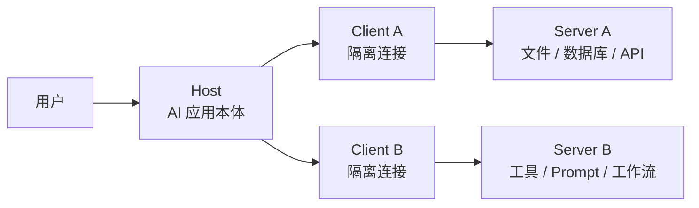
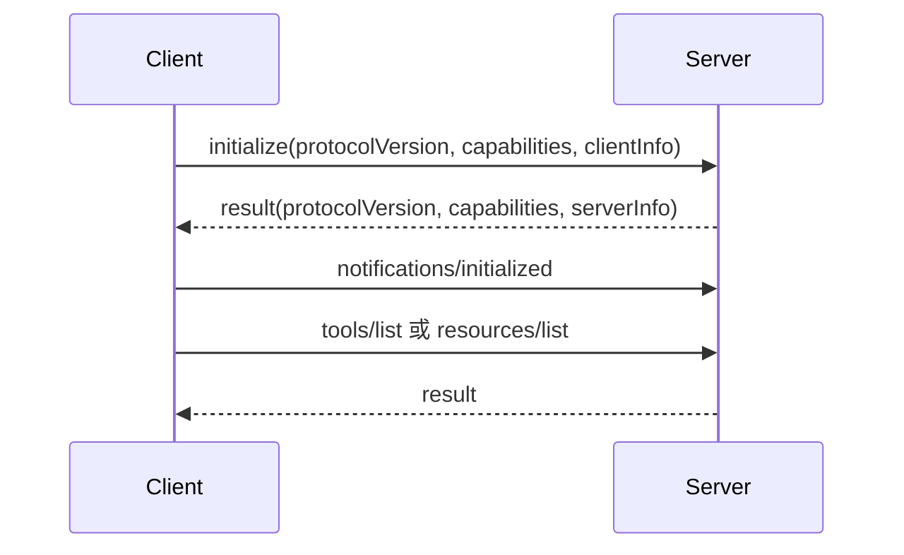

MCP（Model Context Protocol，模型上下文协议）是一个把 AI 应用连接到外部系统的开放协议。它解决的不是“模型怎么推理”，而是“AI Host 如何以统一方式发现上下文、读取数据、调用工具、触发工作流，并把这些能力放在可协商、可隔离、可审计的协议边界内”。

本文围绕 MCP `2025-11-25` 规范整理五个主干问题：架构，基础协议与生命周期，Tools，Resources 与 Prompts，Authorization、Elicitation 与 Schema。

::: info 当前版本
截至本文发布时，官方最新版本为 `2025-11-25`，版本相关结论以官方规范页面为准。
:::

<!-- more -->

## 1. 架构：Host、Client、Server 与能力控制权

MCP 采用 client-host-server 架构。Host（宿主应用）是最终面向用户和模型的应用，例如聊天客户端、IDE、Agent 运行环境。Client（协议客户端）由 Host 创建，每个 Client 维护一个到特定 Server 的有状态连接。Server（能力服务器）独立暴露 Resources、Tools、Prompts 等能力，可以是本地子进程，也可以是远程 HTTP 服务。



这个拆分的关键不是命名，而是隔离边界：

- Host 管用户授权、用户确认、LLM 集成、上下文聚合，以及跨 Server 的安全策略。
- Client 负责单个 Server 连接的协议协商、消息路由、订阅和通知。
- Server 只暴露自己负责的能力，不应该看到完整对话，也不应该看到其他 Server 的数据或调用。

所以一个 Host 可以同时连接多个 MCP Server，但每条连接都是 1:1 的 Client-Server 会话。跨 Server 的组合、工具是否允许被模型调用、哪些资源进入上下文，最终都由 Host 控制。

MCP 的三类 Server 能力有不同控制权：

- Tools（工具）是 model-controlled（模型控制）的能力。模型可以基于上下文发现并请求调用工具，例如查数据库、调用 API、执行计算。但 Host 仍应提供用户确认和审计，尤其是写操作、外部请求和高风险动作。
- Resources（资源）是 application-driven（应用驱动）的上下文。Server 暴露文件、数据库 schema、文档、业务对象等可读数据，Host 决定如何展示、搜索、选择或自动注入上下文。
- Prompts（提示模板）是 user-controlled（用户控制）的工作流入口。Server 提供可参数化的 Prompt，用户通常通过 UI、命令或菜单显式选择。

这三者常被混用，但语义不同：Tool 是“让模型做动作”，Resource 是“给模型读上下文”，Prompt 是“给用户选一套对话或任务模板”。实现 MCP Server 时，先判断待暴露的是动作、数据还是模板，再决定放在哪个 primitive（协议原语）里。

::: important 控制权边界
Tools 是模型控制的动作入口，Resources 是应用驱动的上下文入口，Prompts 是用户控制的工作流入口。三者的边界决定了权限、确认和审计应该放在哪一层。
:::

## 2. 基础协议：JSON-RPC、生命周期与传输

MCP 的底层消息基于 JSON-RPC 2.0。所有实现都必须支持 Base Protocol（基础协议）和 Lifecycle Management（生命周期管理），其他能力按需协商。

JSON-RPC 在 MCP 中主要有三类消息：

- Request（请求）：带 `id`、`method`、可选 `params`，期望对方返回 Response。请求可以由 Client 发给 Server，也可以由 Server 发给 Client。
- Response（响应）：响应某个 Request，必须复用请求的 `id`，要么包含 `result`，要么包含 `error`。
- Notification（通知）：只有 `method` 和可选 `params`，没有 `id`，接收方不能返回响应。

一个最小消息形态如下：

```json
{ "jsonrpc": "2.0", "id": 1, "method": "tools/list", "params": {} }
{ "jsonrpc": "2.0", "id": 1, "result": { "tools": [] } }
{ "jsonrpc": "2.0", "method": "notifications/initialized" }
```

Request 的 `id` 必须是字符串或数字，不能是 `null`，同一会话内同一请求方不能重复使用。Notification 不能带 `id`。这几个约束看似普通，但它们会直接影响 Server 的路由器实现：一行输入进来后，先判断是否有 `id`，再决定是否必须回包。

生命周期从 `initialize` 开始。Client 必须先发送 `initialize` 请求，携带协议版本、Client 能力和 Client 信息。Server 返回协议版本、Server 能力和 Server 信息。初始化成功后，Client 再发送 `notifications/initialized` 通知，表示进入正常工作阶段。



典型的最小初始化响应可以很小：

```json
{
  "jsonrpc": "2.0",
  "id": 1,
  "result": {
    "protocolVersion": "2025-11-25",
    "capabilities": {
      "tools": {}
    },
    "serverInfo": {
      "name": "minimal-mcp-server",
      "version": "0.1.0"
    }
  }
}
```

能力协商是 MCP 的扩展机制。Server 只有声明了 `tools`，Client 才应该调用 `tools/list` 和 `tools/call`；声明了 `resources`，才提供 `resources/list`、`resources/read`；声明了 `prompts`，才提供 `prompts/list`、`prompts/get`。Client 侧也有能力，例如 `sampling`、`roots`、`elicitation`。协商完成后，双方都必须只使用已经协商成功的能力。

MCP 标准传输主要有两种。

stdio 是最适合本地最小实现的传输方式。Host 启动 Server 子进程，Server 从 `stdin` 读 JSON-RPC 消息，向 `stdout` 写 JSON-RPC 消息。每条消息用换行分隔，消息内部不能包含裸换行；日志必须写到 `stderr`，不能污染 `stdout`。对本地工具集成来说，这个模型非常轻：一个循环读行、解析 JSON、按 `method` 分发、写回 JSON 即可。

Streamable HTTP 面向远程或多客户端场景。Server 暴露一个 MCP endpoint，例如 `/mcp`，支持 POST 和可选 GET。Client 每发一个 JSON-RPC 消息都用新的 HTTP POST，请求体是单个 JSON-RPC Request、Notification 或 Response，并通过 `Accept` 声明支持 `application/json` 和 `text/event-stream`。Server 可以直接返回 JSON，也可以返回 SSE（Server-Sent Events，服务器发送事件）流，用于流式响应、Server 到 Client 的请求或通知。GET 则用于 Client 主动打开 SSE 流接收 Server 消息。

HTTP 传输必须额外考虑 Web 安全：Server 要校验 `Origin` 防 DNS rebinding（DNS 重绑定），本地服务应绑定 localhost 而不是 `0.0.0.0`，远程连接应有认证。HTTP 还要求初始化后在后续请求中携带 `MCP-Protocol-Version` header，以保证协议版本明确。

## 3. Tools：可调用动作、Schema 合约与错误分层

Tools 是 MCP 中最像传统后端接口的部分。Server 通过 `tools/list` 暴露工具清单，通过 `tools/call` 接收工具调用。每个 Tool 至少有稳定的 `name`、说明性 `description`，以及描述入参的 `inputSchema`。可选的 `outputSchema` 用于约束结构化输出。

一个压缩后的 Tool 定义与调用结果如下：

```json
{
  "name": "get_order",
  "description": "Fetch one order by id",
  "inputSchema": {
    "type": "object",
    "properties": {
      "orderId": { "type": "string" }
    },
    "required": ["orderId"],
    "additionalProperties": false
  },
  "outputSchema": {
    "type": "object",
    "properties": {
      "orderId": { "type": "string" },
      "status": { "type": "string" }
    },
    "required": ["orderId", "status"]
  }
}
```

`tools/call` 的请求参数是 `name` 和 `arguments`。Server 执行后返回 `content`，也可以返回 `structuredContent`。`content` 面向模型和用户渲染，可以是 text、image、audio、resource_link 或 embedded resource；`structuredContent` 是 JSON object，面向程序解析。如果 Tool 声明了 `outputSchema`，Server 必须保证 `structuredContent` 符合它，Client 也应验证。

一个调用响应可以同时兼容人读和程序读：

```json
{
  "jsonrpc": "2.0",
  "id": 2,
  "result": {
    "content": [
      { "type": "text", "text": "{\"orderId\":\"A-100\",\"status\":\"paid\"}" }
    ],
    "structuredContent": {
      "orderId": "A-100",
      "status": "paid"
    },
    "isError": false
  }
}
```

这里有一个很重要的工程边界：协议错误和工具执行错误不是一回事。

协议错误应该用 JSON-RPC `error` 返回，例如未知工具、JSON 结构不合法、`tools/call` 参数不满足协议 schema、Server 内部协议处理失败。它表示“这次 MCP 消息本身不能成立”。

工具执行错误应该用正常 JSON-RPC `result` 返回，并设置 `isError: true`，例如外部 API 返回失败、业务规则不满足、日期范围非法、库存不足。它表示“工具被成功调用了，但业务执行失败”。这类错误通常应把可操作反馈放进 `content`，让模型有机会修正参数后重试。

最小实现中，一个实用规则是：JSON 解析、method 路由、参数结构错误走 JSON-RPC `error`；Tool 业务内部失败走 `isError: true`。不要把所有异常都塞进 HTTP 500 或 JSON-RPC error，否则模型无法区分“协议坏了”还是“参数需要改”。

::: warning 错误分层
协议错误表示 MCP 消息不成立，应该走 JSON-RPC `error`；工具执行错误表示调用成立但业务失败，应该走 `result.isError = true`。这条边界会直接影响模型是否能基于结果修正参数并重试。
:::

## 4. Resources 与 Prompts：读上下文和复用工作流

Resources 是 Server 暴露给 Client 的可读上下文。每个 Resource 用 URI 唯一标识，可以是 `file://`、`git://`、`https://`，也可以是自定义 URI scheme。`resources/list` 用于发现资源，`resources/read` 用于读取内容，`resources/templates/list` 用于暴露参数化资源。

一个资源读取响应的核心结构是：

```json
{
  "jsonrpc": "2.0",
  "id": 3,
  "result": {
    "contents": [
      {
        "uri": "file:///project/README.md",
        "mimeType": "text/markdown",
        "text": "# Project\n..."
      }
    ]
  }
}
```

Resource 内容可以是 `text`，也可以是 base64 编码的 `blob`。Resource metadata 可以包含 `name`、`title`、`description`、`mimeType`、`size`、`annotations`。模板则用 URI Template 表示，例如 `file:///{path}`，让 Client 或用户用参数定位资源。订阅能力是可选的，如果 Server 声明 `resources.subscribe`，Client 可以订阅资源变更并接收 `notifications/resources/updated`。

Prompts 是 Server 提供的提示模板。`prompts/list` 返回可用模板和参数定义，`prompts/get` 用参数实例化模板，返回一组消息。消息有 `role`，通常是 `user` 或 `assistant`，内容可以是 text、image、audio 或 embedded resource。

Prompts 和 Tools 的区别尤其重要：Prompt 不应该偷偷执行副作用，它是用户显式选择的一套任务指令或对话模板；Tool 是模型可以请求执行的动作。Prompts 和 Resources 的区别也很明确：Prompt 产出“消息结构”，Resource 产出“可读数据”。一个代码审查场景里，Prompt 可以是“按安全、性能、可维护性审查这段代码”的模板，Resource 可以是实际代码文件和项目规范，Tool 可以是运行测试、查询 CI 或创建 issue 的动作。

## 5. Authorization、Elicitation 与 Schema：安全边界和类型合约

Authorization（授权）只在 HTTP-based transports 中有标准化规范。stdio transport 不应套用这套 OAuth 流程，而应从环境变量、配置文件或 Host 提供的本地安全机制中取凭据。HTTP 场景下，受保护的 MCP Server 扮演 OAuth 2.1 resource server（资源服务器），MCP Client 扮演 OAuth client（客户端），Authorization Server（授权服务器）负责用户交互和发放 access token。

HTTP 授权的关键工程点如下：

- MCP Server 通过 OAuth 2.0 Protected Resource Metadata 暴露授权服务器位置；Client 必须支持从 `WWW-Authenticate` header 或 well-known URI 发现 metadata。
- Client 访问 MCP Server 时，access token 必须放在 HTTP `Authorization` header 中，格式是 `Authorization: Bearer <access-token>`，而且每个 HTTP 请求都要带。
- Access token 不能放在 URI query string 中。
- Server 必须校验 token 是否签发给自己这个 audience，不能接受或转发其他资源的 token。
- 过期或无效 token 返回 401；scope 不足返回 403，并通过 `WWW-Authenticate` 提示所需 scope。
- 授权端点必须走 HTTPS，授权码流程需要 PKCE，Client 还要限制重试，避免无限 step-up authorization（提权授权）循环。

Elicitation（信息征询）是 Client 能力，允许 Server 在交互中向用户请求额外信息。它不是“Server 直接弹窗”，而是 Server 发 `elicitation/create` 给 Client，Client 负责 UI、用户同意、隐私边界和响应。

Elicitation 有两种模式：

- form mode：在 MCP Client 内收集结构化数据。Server 提供 `requestedSchema`，Client 渲染表单并校验用户输入。它适合用户名、邮箱、选项、普通配置等非敏感信息。
- url mode：让用户跳到外部 URL 完成敏感或安全操作，例如输入 API key、支付、第三方 OAuth 授权。敏感数据不经过 MCP Client，也不进入 LLM 上下文。

一个 form mode 请求可以很小：

```json
{
  "jsonrpc": "2.0",
  "id": 4,
  "method": "elicitation/create",
  "params": {
    "mode": "form",
    "message": "请提供 GitHub 用户名",
    "requestedSchema": {
      "type": "object",
      "properties": {
        "username": { "type": "string" }
      },
      "required": ["username"]
    }
  }
}
```

url mode 要额外包含 `url` 和 `elicitationId`。它容易和 MCP Authorization 混淆，但二者边界不同：MCP Authorization 是 MCP Client 访问 MCP Server 的授权；url mode elicitation 是 MCP Server 为了完成某个业务动作，引导用户去完成外部敏感交互。规范明确指出，url mode 不会改变 MCP Client 到 MCP Server 的 bearer token；Client 只是向用户展示目标域名、解释原因并获取导航同意。

Schema 是 MCP 的类型合约。完整协议以 TypeScript schema 为 source of truth（事实来源），并生成 JSON Schema 供工具使用。MCP 在协议中大量使用 JSON Schema：Tool 的 `inputSchema` 和 `outputSchema`、elicitation 的 `requestedSchema`、通用消息结构等。默认 dialect 是 JSON Schema 2020-12；实现必须支持没有 `$schema` 字段时按 2020-12 校验，也要能优雅处理不支持的显式 dialect。

Schema 不是安全策略本身。它只能说明“形状是否正确”，不能替代权限校验、URI 白名单、输出脱敏、速率限制、审计日志和用户确认。Server 端仍然要把来自 Client、模型和用户的所有输入都当成不可信数据处理。

## 7. 官方参考

- [What is the Model Context Protocol](https://modelcontextprotocol.io/docs/getting-started/intro)
- [Architecture](https://modelcontextprotocol.io/specification/2025-11-25/architecture)
- [Base Protocol Overview](https://modelcontextprotocol.io/specification/2025-11-25/basic)
- [Lifecycle](https://modelcontextprotocol.io/specification/2025-11-25/basic/lifecycle)
- [Transports](https://modelcontextprotocol.io/specification/2025-11-25/basic/transports)
- [Tools](https://modelcontextprotocol.io/specification/2025-11-25/server/tools)
- [Resources](https://modelcontextprotocol.io/specification/2025-11-25/server/resources)
- [Prompts](https://modelcontextprotocol.io/specification/2025-11-25/server/prompts)
- [Authorization](https://modelcontextprotocol.io/specification/2025-11-25/basic/authorization)
- [Elicitation](https://modelcontextprotocol.io/specification/2025-11-25/client/elicitation)
- [Schema Reference](https://modelcontextprotocol.io/specification/2025-11-25/schema)
