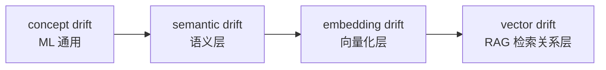
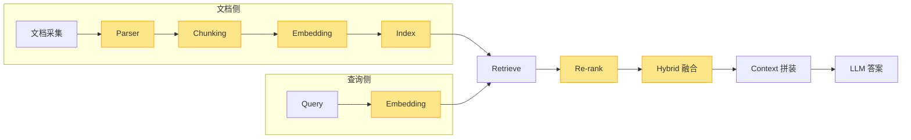
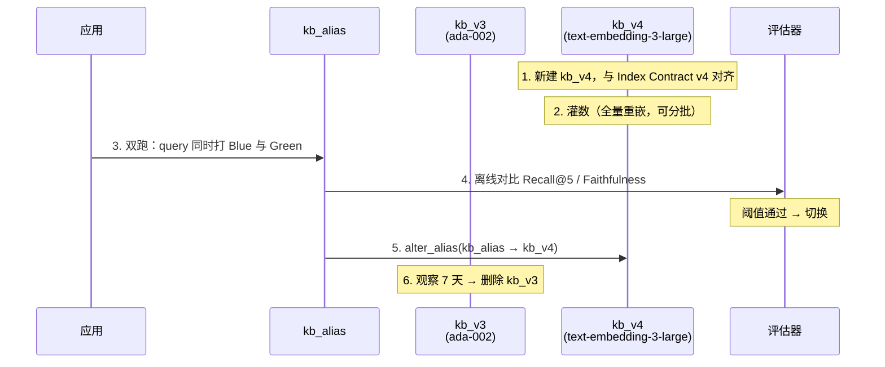
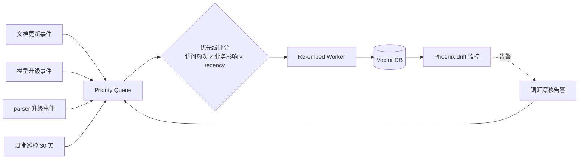

一个上线半年的企业知识库 RAG，没人改过代码，向量库的容量曲线平稳上升，延迟、QPS、成功率三条监控曲线都健康。但客服开始抱怨：「问不到东西了」、「以前能查到的现在排在第三页」、「问 2024 年的政策结果给我推了 2022 年的版本」。

检索质量在悄悄下降，没有任何告警告诉你。

这不是 bug，也不是事故。它是一类隐蔽、渐进、传统监控难以察觉的架构层退化，业内直到 2025 年才被 Microsoft Azure 系统化命名为 **vector drift**（向量漂移）。它不是某个组件的失效，而是 RAG 全链路上多个组件随时间不同步演进所累积的结果。这篇文章把「为什么会漂」「怎么知道在漂」「怎么治」一次摆清楚。

::: tip 核心思路
把 embeddings 当成**动态资产**去管理，而不是建库时的**一次性产物**。
:::

<!-- more -->

## 1. vector drift 在概念图谱中的位置

「漂移」这个词在工程师圈里被用得很乱。在动手治理之前，先把它放进概念图谱里——同名词背后是不同的方法论，混用会让讨论失焦。

| 术语                | 出处与年代               | 含义                                                                       | 是否 RAG 专用 |
| ------------------- | ------------------------ | -------------------------------------------------------------------------- | ------------- |
| **concept drift**   | ML 经典（1980s 起）      | 输入特征与目标变量的统计关系随时间变化，是 ML 监控的通用概念               | 否            |
| **semantic drift**  | 语言学 / NLP（2000s 起） | 词汇语义在历时维度上的演化；NLP 中也指 embedding 表示的语义随训练数据变化  | 否            |
| **embedding drift** | ML monitoring 工具圈     | 同一/同类输入产生的向量在时间维度上变化（Evidently、Arize、AWS 文档采用）  | 部分          |
| **vector drift**    | Microsoft Azure（2025）  | 索引中存储的 embeddings 不再准确表达查询侧 embeddings 的语义意图           | 是            |

四个术语层层递进：concept drift 是上位词，描述任意 ML 系统中输入分布与目标关系的变化；semantic drift 把视野收到语义空间；embedding drift 收到向量化表示；vector drift 是 RAG 语境下最精确的命名。它的定义里有一个细节值得反复读：不是任意嵌入在变，而是「索引侧 embeddings 与查询侧 embeddings 的相对位置错位」。这是关系性而非绝对性的漂移。



把这件事定准了，治理思路就清晰了：**你要监控的不是某一侧的绝对变化，而是两侧的相对位置**。后面所有方法都围绕这一点展开。

## 2. 漂移成因谱

把 vector drift 打开看，会发现成因不止 embedding 模型一处。沿 RAG 全链路画一遍，至少有八类独立可漂移的因子，分布在文档侧、查询侧、排序融合层、契约层四个区域。



八条线，每一条都可以独立失守。下面逐一拆解（图中黄色节点是漂移点）。

### 2.1 Embedding 模型版本错配

最致命也最常见的一类。文档入库用 `text-embedding-ada-002`，半年后查询侧悄悄升级到 `text-embedding-3-large`，接口都通、相似度还能算出分数，但这两个模型生成的向量根本处于不同的向量空间。

不同模型的向量空间为什么不可直接比较？因为它们各自独立训练，contrastive、SimCSE、监督负采样的训练范式不同，坐标基、尺度、方向都是任意的。「语义近 → 向量近」只在同一模型内部成立，跨模型则毫无保证。Microsoft 官方博客把这点说得最直白：「embeddings from different models exist in different vector spaces and are not mathematically comparable」。

错配的影响有多大，OpenAI 自家公布过一组硬数字：ada-002 → text-embedding-3-large 在 MIRACL 多语种检索上提升了 23.5 个点（31.4 → 54.9），MTEB 提升 3.6 个点。反过来看，如果只升级了查询侧而没重嵌文档库，相当于让两侧用方言不同的语言对话，召回质量退化幅度可能是同一量级。

学术上确实有跨模型对齐研究，最新的一手工作是 [arXiv 2510.13406](https://arxiv.org/abs/2510.13406)（2025），证明只要 pairwise dot products 近似保持，就存在等距正交变换可以对齐两套 embedding。但工程结论简单清晰：**重嵌的成本远低于维护对齐管线**。除非你有大量稳定的高质量锚点对，否则不要把跨模型对齐当治理手段。

::: important
一个索引在生命周期内**绑定唯一的 embedding 模型与维度**，更换即整库重建。
:::

### 2.2 旧向量未随内容演进刷新

前一类的根因是模型在变。这一类反过来：模型不变，是内容在变。

向量空间是相对的。系统持续向索引中加入新内容（新政策、新产品、新术语），新内容的 embedding 会悄然「拉动」语义空间的局部结构，旧文档的 embedding 留在过去。即使旧文档本身仍然内容正确，它在当前查询者的语义坐标系里也会逐渐边缘化，表现就是检索结果过度偏向新文档，旧文档明明高度相关却排不进 top-k。

治理思路只有一个变化：把 embeddings 当动态资产而不是静态产物。按周期重嵌一遍稳定语料、对高访问 / 高影响文档优先重嵌、当领域词汇发生显著变化时触发一次全量重嵌。具体管线在 4.3 节展开。

### 2.3 Chunking 策略漂移

Chunking 是 RAG 里最被低估的「无声变量」。chunk_size 从 512 改到 1024、overlap 从 50 调到 100、PDF parser 从 PyPDF2 换到 pdfplumber、OCR 引擎升级了一版，每一次改动都会改变 chunk 的语义密度和上下文边界，进而改变 embedding 的分布。多种 chunking 策略混在同一索引里，排序的稳定性就再也找不回来。

还有一个反直觉的实证：NAACL 2025 Findings 与 Vecta 2026 基准都得出类似结论，在多数任务上「recursive 256-512 tokens + 10-20% overlap」并不输给更花哨的 semantic chunking，甚至在 RAG 端到端指标上反而更稳。配合 Chroma 自家的「context rot」研究——retrieval 性能会随上下文长度退化——结论是 **别为新而新换 chunking 策略，要换就把整个索引重建**。

### 2.4 Query 分布漂移

漂移不只发生在文档侧。生产期用户的查询分布会持续偏离当初设计 RAG 时的参考分布：新业务术语涌现（公司发布新产品 X，三周后所有客服 query 都带 X）、用户行为迁移（从关键词变成自然语言）、用户群体变化（B 端转 C 端）。

这类漂移在经典 IR 里另有一个含义（Shtok, Kurland, Carmel 2009 提出的查询扩展语义偏离），现代 RAG 语境下专指生产查询分布相对训练 / 参考分布的偏移。检测有三层手段：

- 嵌入级：用 PSI（Population Stability Index）对比近 7 天与历史 30 天的 query embedding 分布。Arize 的经验阈值是 < 0.1 稳定、0.1-0.25 关注、≥ 0.25 必须介入
- 业务代理：Zero-Result Rate（ZRR）是最直接的代理指标。Algolia 的电商基准是 < 2-3% 优秀、> 10% discovery 体验已经崩溃
- 覆盖度：top-k 命中文档的来源分布是否突然偏向某几篇，往往是新业务术语没建索引

::: warning 反模式：指标游戏化
为了把 ZRR 压下去而强行返回热门文章，指标看着好，**本质是欺骗**。Algolia 工程博客明确警告过这种做法，叫它「指标游戏化」。
:::

### 2.5 Query / Document 模型非对称

2.1 的特殊变种，单独拎出来是因为它的「漂移」往往是有意为之。常见动机：query 模型更精准但更贵，于是只升级 query 侧节省成本；或者 query 走 OpenAI、doc 走自部署 BGE。两侧落到不同向量空间，相似度计算变成无意义的数字游戏。

工业上唯一靠谱的非对称做法是 asymmetric semantic search，专门为非对称场景训练的 query / passage 双塔。Microsoft E5 系列就是典型：在 query 与 passage 前加不同 prefix `query:` / `passage:` 来打破对称性，但本质上仍然是同一模型在同一向量空间内的双向使用，而不是跨模型混搭。

### 2.6 Re-ranker 漂移

走到排序层。Re-ranker（cross-encoder）的工作方式与 retriever（bi-encoder）截然不同：前者把 `[CLS] query [SEP] doc [SEP]` 作为单一输入，每层 attention 直接建模 query 与 doc 的 token 级交互，精度高但成本高，只能在 retriever 召回的 top-100 上跑。

漂移有两种形态。一是领域漂移，MS MARCO 训练的通用 cross-encoder 在法律、医疗等专业语料上不识专业术语，用了 9 个月的通用 reranker 会随业务专业化而逐步失配。二是版本错配，retriever 升级了（比如 ada-002 → 3-large），reranker 还是老的；reranker 是 retriever-agnostic 的，可以独立升级，但它的天花板永远是 retriever 召回质量。

Salespeak 团队 4 个月微调实测后留了一句很值得记住的话：**no reranker will save bad retrieval**。reranker 升级最低成本的做法是拉 500 条生产 query 加候选集，人工标 ground truth，三路对比 cosine baseline、当前 reranker、候选 reranker 的 nDCG@5 与 Recall@5。

### 2.7 Hybrid search 权重失衡与 BM25 IDF 老化

混合检索（BM25 + dense vector）的两条路径各自漂移、相互失衡，是少有人监控的盲区。

BM25 的 IDF 公式：

$$
\mathrm{IDF}(q_i) = \ln \frac{N - n(q_i) + 0.5}{n(q_i) + 0.5}
$$

$N$ 是语料文档总数、$n(q_i)$ 是含词 $q_i$ 的文档数。**$N$ 与 $n(q_i)$ 都随入库增长持续变化，IDF 因此天然随时间漂移**。一个词从初期的「罕见高 IDF 高权重」漂到后期的「常见低 IDF 低权重」，排序会肉眼可见地变化；当词出现在 50% 以上文档时 IDF 还会变负值，需要做 floor。

融合层面，工业上为什么默认 RRF（Reciprocal Rank Fusion）而不是 linear combination？因为 BM25 分数无界、cosine 在 $[0,1]$，分布尺度完全不一致，linear 加权的 $\alpha$ 参数一旦语料漂移就立刻失效。RRF 只看 rank 位置，绕过归一化问题：

$$
\mathrm{score}_{\text{RRF}}(d) = \sum_{i \in \text{rankers}} \frac{1}{k + \mathrm{rank}_i(d)}
$$

$k$ 默认 60，$\mathrm{rank}_i(d)$ 是文档 $d$ 在第 $i$ 路 ranker 结果中的位置。这是 Elasticsearch、OpenSearch、Qdrant、Weaviate 都默认它的工程原因：

```python
def rrf_fuse(bm25_results, vec_results, k=60):
    """RRF 融合：BM25 与向量两路 rank list，k 默认 60"""
    scores = {}
    for rank, doc_id in enumerate(bm25_results, start=1):
        scores[doc_id] = scores.get(doc_id, 0) + 1.0 / (k + rank)
    for rank, doc_id in enumerate(vec_results, start=1):
        scores[doc_id] = scores.get(doc_id, 0) + 1.0 / (k + rank)
    return sorted(scores.items(), key=lambda x: -x[1])
```

RRF 也不是无脑选。SKU、error code 这类精确查询场景 BM25 应该加权（Weaviate 工程经验：BM25 1.0 / 向量 0.7），纯概念查询反过来。权重应纳入回归测试，而不是上线后再也不动。

### 2.8 Metadata schema 漂移与 parser 不齐

最后一类是数据契约层的漂移。document 字段从 `{title, content}` 演化成 `{title, content, summary, tags}`；metadata filter 用的字段名从 `dept` 改成 `department`；parser 升级后给同一 PDF 切出的 chunk 数量从 8 变 12。这些变化不会触发任何语义层面的告警，却会让 metadata filter、boost 规则、混合排序逻辑全部错位。

治理手段是把 chunking、parser、embedding model、metadata schema 写成一份显式的 Index Contract，下一章详述。

## 3. 监控

八类成因摆完，下一个问题是：怎么知道它正在发生。

漂移监控的难点在于它是渐进的。一周不会触发任何告警，一季度后业务才察觉问题。所以不能等到 P0 用户投诉再回头查，必须建立分层的指标体系，让漂移在不同时间尺度上都能被先看到。

### 3.1 三层指标体系

由细到粗：

| 层级       | 指标                                                        | 告诉你什么                          |
| ---------- | ----------------------------------------------------------- | ----------------------------------- |
| **检索层** | Recall@k、Hit Rate@k、MRR、nDCG@k、Context Precision/Recall | 召回是否覆盖到正确文档，排序是否合理 |
| **答案层** | Faithfulness、Answer Relevancy、Groundedness                | LLM 是否在用召回的内容回答           |
| **业务层** | Zero-Result Rate、用户点击位次、人工反馈、追问率            | 用户是否在体验上感到退化             |

检索层指标的工业经验值给一个参考：FAQ / 帮助中心场景 Recall@5 ≥ 80%、带 reranker 的 nDCG@5 ≥ 0.8、MRR ≥ 0.6 用户感觉「snappy」。这些不是绝对标准而是基线，你应该建立自己业务的基线并监控偏离幅度。

三层之间存在时间错位。嵌入级 PSI 通常比业务侧 ZRR 早 2-4 周捕获到漂移趋势，Faithfulness 时序又比 PSI 更晚才出现劣化。三层都要看，不能用单一信号决策。

### 3.2 Faithfulness 与 LLM-as-judge 的盲区

答案层最常用的指标是 Faithfulness。Ragas 的官方定义很简洁：被 retrieved context 支持的 claim 数 / LLM 答案中所有 claim 数。日常监控通常这样跑：

```python
from ragas import evaluate
from ragas.metrics import Faithfulness, AnswerRelevancy, ContextPrecision
from datasets import Dataset

dataset = Dataset.from_dict({
    "question":     [...],   # 100 条采样的生产 query
    "answer":       [...],   # LLM 生成的答案
    "contexts":     [...],   # 检索到的 chunk 列表
    "ground_truth": [...],   # 离线时由专家标注或 LLM 蒸馏
})

result = evaluate(
    dataset,
    metrics=[Faithfulness(), AnswerRelevancy(), ContextPrecision()],
)
print(result)
```

拿到 CI 里跑，把指标曲线画在看板上。一旦 Faithfulness 突降，往往意味着索引被坏 chunk 污染，或者 embedding 模型刚发生过版本漂移。

::: warning LLM-as-judge 的根本盲区
Faithfulness 只判断「答案是否忠实于 context」，**无法判断 context 本身是否正确**。0.95 的 Faithfulness 仍然可能给出业务上完全错误的答案，只要 LLM 忠实于一段错的 context。这就是 3.1 里业务层指标必须存在的原因——业务反馈是最后一道兜底。
:::

### 3.3 工具栈选择

评估与监控工具不少，但定位差异很大。按需选 1-2 个，不要叠 buff：

| 工具          | 强项                                                             | 是否原生支持 embedding/retrieval drift |
| ------------- | ---------------------------------------------------------------- | -------------------------------------- |
| **Ragas**     | RAG 评估事实标准，Faithfulness / Answer Relevancy 等             | 间接（指标时序对比）                   |
| **Phoenix**   | OpenInference + UMAP 嵌入聚类 + euclidean drift 时序             | 是（业内唯一原生）                     |
| **LangSmith** | trace + online evaluator，与 LangChain 深度集成                  | trace 强，drift 需自定义               |
| **Langfuse**  | 自托管 trace + prompt 版本，开源 MIT                             | trace 强，drift 需自定义               |
| **TruLens**   | RAG Triad（Context Relevance + Answer Relevance + Groundedness） | 间接                                   |
| **DeepEval**  | pytest 风格离线回归                                              | 否                                     |

最小可用的「漂移看板」配置：Phoenix 在线监控嵌入分布漂移、Ragas 离线跑生产 query 子集做 Faithfulness 时序、业务侧自建 ZRR 与追问率。Phoenix 是少数把 retrieval / embedding drift 做成一等公民的开源平台，centroid 漂移图配 HDBSCAN 聚类，能直接告诉你「哪个 query 簇正在远离索引中心」。

## 4. 治理

指标看到了漂移，下一个问题是怎么治。

治理的核心思路只有一句话：**embeddings 不是建库时的一次性产物，而是有生命周期、需要版本控制、需要按事件 / 周期重新生成的动态资产**。围绕这条主线，下面四套实践配合使用，覆盖从契约定义到上线切换的完整闭环。

### 4.1 Index Contract：把契约写进 metadata

Index Contract 的本质是把「这个索引是怎么造出来的」显式化、版本化，入库时一并写进 metadata，而不是隐藏在散落的 ingestion 脚本里。最小字段集：

| 字段               | 含义                                       | 漂移检测用途                  |
| ------------------ | ------------------------------------------ | ----------------------------- |
| `document_id`      | 文档稳定 ID                                | 跨版本追踪                    |
| `document_version` | 文档版本（业务侧版本号 / 哈希）            | 旧版本检索过滤                |
| `chunk_id`         | chunk 稳定 ID                              | 增量 re-embed 单元            |
| `chunk_version`    | chunking 策略版本                          | 策略变更时筛选 / 重建         |
| `embedding_model`  | 模型名 + 版本（如 `text-embedding-3-large`）| 跨模型混索检测                |
| `embedding_dim`    | 向量维度                                   | 维度变更预警                  |
| `parser_version`   | parser 版本（如 `unstructured-0.15.1`）    | parser 升级影响审计           |
| `schema_version`   | metadata schema 版本                       | 字段演进时回滚                |
| `indexed_at`       | 入库时间                                   | recency 优先级、按时间窗重嵌  |

对应的 ingestion 代码，以 OpenAI Embeddings + Qdrant 为例：

```python
import datetime, hashlib, uuid
from openai import OpenAI
from qdrant_client import QdrantClient
from qdrant_client.models import PointStruct

client = OpenAI()
qdrant = QdrantClient(url="http://localhost:6333")

INDEX_CONTRACT = {
    "embedding_model": "text-embedding-3-large",
    "embedding_dim":   3072,
    "chunk_version":   "recursive-512-overlap-50-v2",
    "parser_version":  "unstructured-0.15.1",
    "schema_version":  "v3",
}

def index_chunk(chunk_text: str, document_id: str, document_version: str):
    embedding = client.embeddings.create(
        model=INDEX_CONTRACT["embedding_model"],
        input=chunk_text,
    ).data[0].embedding

    chunk_id = hashlib.sha256(
        f"{document_id}:{document_version}:{chunk_text[:64]}".encode()
    ).hexdigest()[:16]

    qdrant.upsert(
        collection_name="kb_v3",
        points=[PointStruct(
            id=str(uuid.uuid4()),
            vector=embedding,
            payload={
                "document_id":      document_id,
                "document_version": document_version,
                "chunk_id":         chunk_id,
                "indexed_at":       datetime.datetime.utcnow().isoformat(),
                **INDEX_CONTRACT,
            },
        )],
    )
```

把 `INDEX_CONTRACT` 作为模块级常量，让 ingestion、re-embedding、检索三处共享同一份引用。任何想改 chunking 或 model 的人必须改这个常量并触发版本号 bump——**「chunking 偷偷漂」这件事就在 code review 阶段被堵住了**。

检索时强制 metadata filter：

```python
results = qdrant.search(
    collection_name="kb_v3",
    query_vector=client.embeddings.create(
        model=INDEX_CONTRACT["embedding_model"],   # 与索引同模型，避免成因 2.5
        input=user_query,
    ).data[0].embedding,
    query_filter={"must": [
        {"key": "embedding_model", "match": {"value": INDEX_CONTRACT["embedding_model"]}},
        {"key": "schema_version",  "match": {"value": INDEX_CONTRACT["schema_version"]}},
    ]},
    limit=20,
)
```

这层 filter 在升级期非常关键。它确保即使旧版本数据还没清完，查询也只命中契约一致的部分。

### 4.2 蓝绿与影子索引

模型升级、chunking 重构、parser 升级这些 breaking change，都不应该 in-place 改，而应该新建索引并行重灌、双跑评估、alias 原子切换。这要求向量库本身把 alias 当一等公民。

| 向量库              | Alias 能力                                                | 模型升级路径                                              |
| ------------------- | --------------------------------------------------------- | --------------------------------------------------------- |
| **Pinecone**        | 无原生 alias                                              | 双索引 + 应用层切流；integrated index 一旦绑定模型不可改  |
| **Weaviate**        | Collection alias 一等公民，原子切换                       | 新 collection → 灌数 → `update alias`                     |
| **Milvus**          | Collection alias 一等公民                                 | `alter_alias(collection, alias)` 原子重指                 |
| **Qdrant**          | Alias + 多 action 原子化 + `insert_only` 模式             | 同一 POST 内 `delete_alias` + `create_alias`              |
| **pgvector**        | 无原生 alias                                              | `CREATE INDEX CONCURRENTLY` + 应用层 view rename          |
| **Chroma**          | 无 alias，Cloud 独占 fork（copy-on-write）                | 新 collection → 灌数 → 应用层切流                         |
| **Azure AI Search** | Index alias（Preview），10 秒传播窗口                     | `PUT /aliases/my-alias { indexes: ["v2"] }`               |

::: caution in-place re-embed 不存在
没有任何主流库支持真正的 in-place re-embed。Pinecone integrated index 文档明确写「once set the model cannot be changed」。「原地升模型」这个想法可以立刻放弃，**蓝绿是唯一可靠路径**。
:::

蓝绿切流的最小流程：



Qdrant 的 alias 切换示例（一个 POST 原子完成）：

```python
qdrant.update_collection_aliases(
    change_aliases_operations=[
        {"delete_alias": {"alias_name": "kb_alias"}},
        {"create_alias": {"alias_name": "kb_alias", "collection_name": "kb_v4"}},
    ]
)
```

影子索引是蓝绿的弱化版：不切流，只把生产 query 镜像一份打到新索引，离线对比指标。适合「想换 chunking 策略但不确定收益是否覆盖成本」的场景。

### 4.3 增量 re-embedding 流水线

蓝绿解决的是 breaking change。日常的「内容演进 + 旧向量边缘化」用蓝绿成本太高，需要一条增量 re-embedding 流水线，按事件触发 + 周期巡检：



优先级评分是这条管线的灵魂。不是所有文档都值得每周重嵌，简化版打分是访问热度、业务层级、新鲜度的加权和：

```python
def reembed_priority(doc, now):
    """返回 0~1，越高越优先"""
    access_score  = min(doc["last_30d_hits"] / 100, 1.0)        # 访问热度归一
    impact_score  = doc["business_tier"]                          # 1.0 / 0.6 / 0.3
    age_days      = (now - doc["indexed_at"]).days
    recency_score = 1.0 / (1 + age_days / 30)
    return 0.5 * access_score + 0.3 * impact_score + 0.2 * recency_score
```

工业上几个值得参考的真实做法：

| 团队                               | 做法                                                                          | 关键收益                                          |
| ---------------------------------- | ----------------------------------------------------------------------------- | ------------------------------------------------- |
| **Notion**                         | Debezium CDC → Kafka → Hudi → S3 → 下游 vector DB，分钟级重嵌修改过的页面     | 实时性，但坦承「刚改的页可能尚未反映在 Q&A」      |
| **GitHub Copilot**                 | SQLite 按 URI + content version 做文件级缓存，FS listener 触发 debounced 重嵌 | 新模型上线后 retrieval +37.6%、index 8x 更小      |
| **Cursor**                         | 仓库构建 Merkle tree，仅上传变更文件                                          | 增量精确到文件粒度                                |
| **Anthropic Contextual Retrieval** | 每个 chunk 入库前由 LLM 注入 50-100 token 的上下文再 embed + 建 BM25          | top-20 失败率 5.7% → 1.9%（配 reranking）         |

Anthropic 的 Contextual Retrieval 这条思路尤其值得注意。它没有改 chunking 策略本身，而是改了「每个 chunk 携带多少上下文」——用 LLM 把全局上下文蒸馏到 chunk 级，让 chunk 即使被独立检索出来也能保持自洽。代价是 ingestion 成本上升一个量级，靠 prompt caching 对冲。这是治理 chunking 漂移的另一条路：从索引管理转向内容增强。

### 4.4 Chunking 治理三件套

Chunking 是漂移源头里最容易「无声漂」的一类，治理只需三条，但每一条都要严格执行：

::: important Chunking 治理三件套
1. **一索引一策略**：同一索引内所有 chunk 出自同一套策略（同一 chunker、同一 chunk_size、同一 overlap、同一 parser），混用导致排序的非确定性
2. **chunk_version 入元数据**：策略版本写进 Index Contract 与每条 chunk 的 metadata，retrieval 与监控时按版本过滤
3. **变更触发整体重建**：任何参数变化都不要「只对新文档生效」，必须 bump chunk_version 并走 4.2 的蓝绿流程整库重建
:::

2.3 节提到过 NAACL 2025 与 Vecta 2026 的实证：recursive 256-512 tokens + 10-20% overlap 在多数任务上不输 semantic chunking。在没有充分基准证明能赢之前，不要为了「上更先进的策略」而引入 chunking 漂移。

## 5. 几个反直觉的边界

治理思路本身也需要边界，否则容易过度工程。下面几条是工程实践里反复印证的「不要做」。

::: warning 不是所有「漂移」都该治
业务真在演化、用户的查询习惯真在变化，检索结果跟着变本身是对的。**治理的目标是消除非业务因素的漂移**，而不是把检索结果冻结在某个时间点。
:::

::: warning 跨模型对齐不是治理手段
Procrustes Bounds 已经证明等距正交变换的存在性，但维护一条对齐管线的成本几乎总是高于直接重嵌。除非你有大量稳定的高质量锚点对，否则把对齐当治理手段就是过度设计。
:::

::: caution in-place re-embed 不存在
Pinecone integrated index 官方明文禁止，其他库即使技术上能改也会破坏向量空间一致性。蓝绿是**唯一可靠路径**，把这件事当作设计前提，而不是优化目标。
:::

::: warning LLM-as-judge 有盲区
Faithfulness 0.95 不等于业务正确——LLM 只判断「答案是否忠实于 context」，无法判断「context 是否正确」。业务层指标必须保留，不要让 Faithfulness 替代用户反馈。
:::

::: tip no reranker will save bad retrieval
看到 reranker 厂商承诺「提升 30% 准确率」时，记住这句来自 Salespeak 团队 4 个月微调实测的话。**reranker 的天花板就是 retriever 的召回质量**——先把召回侧治理好，再考虑用 reranker 优化排序。
:::

## 6. 治理蓝图速查

把全文压成一份执行清单：

- 索引绑定唯一 embedding 模型与维度，绝不跨模型混索
- chunking 策略写进 Index Contract，chunk_version 入 metadata，变更必走蓝绿
- 优先选支持 alias 的向量库（Weaviate / Milvus / Qdrant / Azure AI Search 一等公民）
- 三层指标看板：Phoenix 嵌入漂移 + Ragas Faithfulness 时序 + 业务侧 ZRR / 追问率
- PSI 阈值：< 0.1 稳定、0.1-0.25 关注、≥ 0.25 介入
- 模型升级 = 整库重嵌 + 蓝绿切流，不要尝试 in-place
- re-embedding pipeline 至少支持事件触发（文档更新 / 模型升级 / parser 升级）+ 周期巡检
- hybrid 权重纳入回归测试，BM25 IDF 长期监控
- reranker 与 retriever 版本耦合关系明确，retriever 升级时同步评估 reranker
- 业务层指标兜底 LLM-as-judge，Faithfulness 不能替代用户反馈

向量漂移不是 RAG 的缺陷，而是任何长期运行的检索系统都必须面对的特性。真正区分一个 demo 级 RAG 与一个生产级 RAG 的，往往不是用了多炫的 chunking 策略或多新的 embedding 模型，而是有没有把 embeddings 当成**动态资产**去管理：契约写明、监控分层、升级流水化、重嵌按需。

把这套机制建起来之后会发现，RAG 系统的工程心智模型也清晰了很多。它不是一个一次性「训出来」的模型，而是一个需要持续投入维护的信息检索基础设施——**更接近搜索引擎，而不是更接近 LLM**。

## 参考资料

- Microsoft Azure — [Vector Drift in Azure AI Search: Three Hidden Reasons Your RAG Accuracy Degrades](https://techcommunity.microsoft.com/blog/azure-ai-foundry-blog/vector-drift-in-azure-ai-search-three-hidden-reasons-your-rag-accuracy-degrades-/4493031)（vector drift 唯一系统化命名的官方来源）
- OpenAI — [New embedding models and API updates](https://openai.com/index/new-embedding-models-and-api-updates/)（text-embedding-3 系列官方公告，含 Matryoshka 与 MIRACL/MTEB 对比数字）
- arXiv 2510.13406 — [When Embedding Models Meet: Procrustes Bounds and Applications](https://arxiv.org/abs/2510.13406)（跨模型对齐最新一手论文）
- arXiv 2402.03216 — [BGE M3-Embedding](https://arxiv.org/abs/2402.03216)
- arXiv 2212.03533 — [Text Embeddings by Weakly-Supervised Contrastive Pre-training (E5)](https://arxiv.org/abs/2212.03533)
- Cohere — [Introducing Embed v3](https://cohere.com/blog/introducing-embed-v3)
- Anthropic — [Contextual Retrieval](https://www.anthropic.com/news/contextual-retrieval)
- Notion Engineering — [Building and Scaling Notion's Data Lake](https://www.notion.com/blog/building-and-scaling-notions-data-lake)
- GitHub Blog — [Copilot's New Embedding Model in VS Code](https://github.blog/news-insights/product-news/copilot-new-embedding-model-vs-code/)
- Robertson & Zaragoza 2009 — [The Probabilistic Relevance Framework: BM25 and Beyond](https://www.researchgate.net/publication/220613776_The_Probabilistic_Relevance_Framework_BM25_and_Beyond)
- Elastic — [What is hybrid search](https://www.elastic.co/what-is/hybrid-search)
- Ragas — [Faithfulness 官方文档](https://docs.ragas.io/en/latest/concepts/metrics/available_metrics/faithfulness/)
- Arize Phoenix — [Embeddings Analysis](https://arize.com/docs/phoenix/cookbook/retrieval-and-inferences/embeddings-analysis)
- Weaviate Docs — [Collection Aliases](https://docs.weaviate.io/weaviate/manage-collections/collection-aliases)
- Qdrant Docs — [Collections（atomic alias actions）](https://qdrant.tech/documentation/manage-data/collections/)
